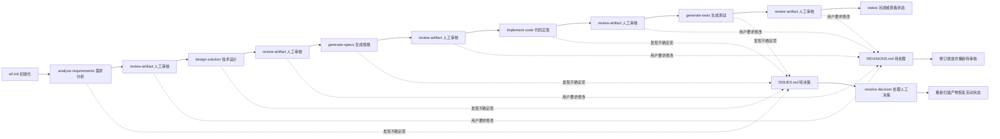

# AIWorkFlow

AIWorkFlow 是一套面向 Agent 的工作空间式研发流程框架。它把 PRD、需求分析、技术设计、开发规格、代码实现、测试生成、人工审核和问题收敛放在同一个可恢复的工作空间中，让 Agent 每次都能按状态、门禁和产物契约继续工作。

一句话：用 `wf` 主入口驱动从 PRD 到测试报告的闭环，中间每个阶段都必须产出可审核、可追溯、可回滚到人工决策的 Markdown 事实文件。

## 核心原则

- **事实优先**：阶段产物及其审核状态是事实源，`CONTEXT.md` 只是运行时状态快照。
- **先审核再推进**：任何阶段产物生成或实质更新后都进入 `review-artifact`，用户确认前不得进入下一阶段。
- **问题不降级**：影响行为、范围、字段、接口、数据结构、统计口径、幂等或测试预期的不确定项必须写入 `ISSUES.md`，不得放进备注、约束或后续细化。
- **修订先落盘**：用户提出明确修改意见时，先写入 `REVISIONS.md`，再收敛目标产物和受影响下游。
- **状态可重建**：`CONTEXT.md` 与产物事实不一致时，以产物事实为准，通过 `rebuild_context.py` 重建。
- **工具兜底**：`validate.py` 负责确定性门禁，Agent 负责语义判断和产物生成。

## 技能入口

| Skill | 职责 |
|---|---|
| `wf` | 主入口。继续流程、执行下一步、处理审核、处理决策、收敛修订、生成代码和测试。 |
| `wf-init` | 在空目录初始化工作空间，复制 PRD，生成初始文件和 `dashboard.html`。 |
| `wf-status` | 只读状态检查和健康检查，不推进流程、不落盘。 |

## 总体流程



流程重点：

- `analyze-requirements` 生成 `output/analysis.md`，但需求是否纳入由用户在 `需求纳入决策表` 中选择。
- `design-solution` 生成 `output/design.md`，包含任务总览、设计视图和任务详情。
- `generate-specs` 为每个 `T-XXX` 生成 `output/specs/T-XXX.md`。
- `implement-code` 修改代码仓库，并生成 `output/reports/T-XXX.md`。
- `generate-tests` 修改测试代码，并生成 `output/test-reports/T-XXX.md`。
- 每个产物都必须先 `待审核`，用户确认后才会变成 `已确认` 并触发状态机事件。

## 工作空间结构

```text
./
├── README.md
├── AGENT.md
├── CONTEXT.md
├── ISSUES.md
├── REVISIONS.md
├── JOURNAL.md
├── CHANGELOG.md
├── dashboard.html
├── prd/
└── output/
    ├── analysis.md
    ├── design.md
    ├── specs/
    │   └── T-XXX.md
    ├── reports/
    │   └── T-XXX.md
    └── test-reports/
        └── T-XXX.md
```

| 文件 | 职责 |
|---|---|
| `AGENT.md` | 当前工作空间的 Agent 约束、平台和编码规范。 |
| `CONTEXT.md` | 运行时状态快照：阶段、下一步、待处理产物、规格索引、代码产出和测试记录。 |
| `ISSUES.md` | Agent 发现的待人工决策问题，按分析、设计、实现、测试阶段分组。 |
| `REVISIONS.md` | 用户主动提出的产物修订意见，先待处理，完成后归档到已处理。 |
| `JOURNAL.md` | 工作流活动日志，用于跨会话恢复。 |
| `CHANGELOG.md` | 已解决人工决策的归档，不记录普通进度。 |
| `dashboard.html` | 由脚本生成的只读人工检视页，不作为事实源。 |
| `prd/` | 初始化时复制的 PRD 来源文件。 |
| `output/` | 阶段产物目录，是流程事实源。 |

## 阶段产物

| 阶段 | 产物 | 关键内容 | 下游依据 |
|---|---|---|---|
| 需求分析 | `output/analysis.md` | PRD 来源、文件清单、需求概要、需求纳入决策表、需求详情 | 技术设计、规格生成 |
| 技术设计 | `output/design.md` | 任务总览、设计视图、任务详情 | 规格生成、任务索引 |
| 规格生成 | `output/specs/T-XXX.md` | 任务概述、依赖、关键行为、实现方案、修改点 | 代码实现 |
| 代码实现 | `output/reports/T-XXX.md` | 修改清单、偏离说明 | 测试生成 |
| 测试生成 | `output/test-reports/T-XXX.md` | 已生成单元测试、未生成单元测试、辅助验证记录、结论 | 测试完成事实 |

所有阶段产物都必须包含 `## 审核状态`：

- `待审核`：Agent 已生成或更新，等待用户确认。
- `需修改`：用户要求调整，修订意见应写入 `REVISIONS.md`。
- `需更新`：上游产物已变化，当前已确认的下游产物失效，需要重新生成或同步。
- `已确认`：用户确认通过，可作为下游阶段输入。

## 需求分析边界

需求分析的目标是形成可审核的结构化需求草案，并暴露阻塞后续设计、规格或实现的待决策问题。

关键规则：

- 必须生成 `需求纳入决策表`。
- 初次生成时，`处理方式` 必须留空，由用户填写 `纳入`、`暂不纳入` 或 `待决策`。
- 用户确认 `output/analysis.md` 前，每条需求的 `处理方式` 必须已填写。
- `约束条件` 只记录既定事实；存疑问题必须进入 `ISSUES.md`。
- `处理方式=待决策` 的需求不得作为已确认需求输入。

## 技术设计边界

技术设计的目标是把已确认需求拆成可独立实现、可独立验证的任务，并产出足够支撑规格生成的技术方案。

`output/design.md` 包含：

- `任务总览`：任务编号、标题、关联需求、依赖和状态。
- `设计视图`：用于降低人工审核成本的 Mermaid 图。
- `任务详情`：每个任务的技术目标、关联需求、依赖、模块架构、接口/方法定义、数据结构、设计约束和影响范围。

设计视图规则：

- 任务数大于 1 时必须提供任务依赖图。
- 涉及类、接口、组件、数据结构或模块对象时默认提供类关系图。
- 涉及跨模块调用、事件、异步回调或外部服务时提供模块交互图或时序图。
- 涉及状态切换、阈值、分支判断、幂等、去重或重置规则时提供状态图或决策流程图。
- 图中的说明文字必须使用中文；类型名、方法名、字段名、文件名、接口名、类名、枚举值等代码标识可以保持英文或项目原始命名。

任务详情边界：

- `技术目标` 只写可验证技术结果，不复述 PRD，不写待确认内容。
- `模块架构` 只写模块、组件、层、职责归属、调用关系、数据流、事件流或边界变化。
- `接口/方法定义` 只写本次新增、修改、签名变化或职责变化的接口/方法，不写未变化调用。
- `数据结构` 只写本次新增、修改、删除的数据类、对象、字段、枚举、配置或 schema。
- `设计约束` 写兼容、异常、兜底、幂等、去重、阈值、状态切换和平台限制。
- `影响范围` 写受影响路径、模块、调用方、测试或回归范围。

## 规格、实现和测试

规格生成：

- 每个设计任务生成一份 `output/specs/T-XXX.md`。
- 规格必须读取设计中的 `技术目标`、`模块架构`、`接口/方法定义`、`数据结构`、`设计约束` 和 `影响范围`。
- 不得只根据任务标题或需求摘要生成规格。

代码实现：

- 只实现当前任务相关范围，不做无关优化。
- 规格中的每个修改点都必须在代码报告中体现。
- 合理偏离也必须写入 `output/reports/T-XXX.md`；需要人工选择的偏离同步写入 `ISSUES.md`。

测试生成：

- 基于规格、实现报告和真实代码变更生成或更新单元测试。
- 默认只修改测试代码和测试报告。
- 暂未生成的测试必须记录原因和后续条件。
- 报告中存在 `阻塞`、`待补充` 或 `已生成，未通过` 时，不得审核为 `已确认`。

## 门禁和状态机

`wf` 每次状态改变前都会运行当前 skill 目录下的校验器：

```text
python <wf-skill-dir>/tools/validate.py <workspace> --action {目标动作} [--target Q-XXX] --json
```

校验器负责确定性检查：

- 工作空间文件和目录是否完整。
- 当前阶段和下一步是否合法。
- 待处理产物是否与审核状态一致。
- 目标动作所需上游产物是否存在且已确认。
- 任务、规格、代码报告、测试报告是否自洽。
- 上游产物变化后，下游是否仍错误地保持 `已确认`。

状态机定义在 `wf/state-machine.md`。主要活动状态为：

```text
initialized
requirements_analyzed
design_ready
specs_ready
implementation_in_progress
implementation_done
tests_done
```

阻塞状态为：

```text
blocked_by_decision
blocked_by_missing_input
blocked_by_inconsistent_state
```

如果 `CONTEXT.md` 与产物事实冲突，运行时应进入 `fix-workspace`，优先执行 `rebuild_context.py` 重建状态快照。

## 问题和修订

`ISSUES.md` 和 `REVISIONS.md` 职责不同：

| 文件 | 来源 | 作用 |
|---|---|---|
| `ISSUES.md` | Agent 发现不确定项 | 等待用户做决策，决策后归档到 `CHANGELOG.md`。 |
| `REVISIONS.md` | 用户主动提出修改意见 | 持久化修订请求，驱动目标产物和下游同步收敛。 |

问题处理流程：

1. Agent 发现影响后续的未决问题，写入 `ISSUES.md`。
2. 工作流进入 `blocked_by_decision`，下一步为 `resolve-decision`。
3. 用户补充 `人工决策`。
4. `wf` 按决策修改产物或代码，归档到 `CHANGELOG.md`，从 `ISSUES.md` 删除目标问题。
5. 重建或更新 `CONTEXT.md`，追加 `JOURNAL.md`。

修订处理流程：

1. 用户提出明确修改意见。
2. `wf` 写入 `REVISIONS.md` 的 `## 待处理`。
3. `wf` 修改目标产物，并判断下游是否可同步。
4. 成功后移动到 `## 已处理`，目标产物回到 `待审核`。
5. 无法处理时保留为 `阻塞`，并按原因进入决策、缺输入或状态不一致流程。

## 下游失效规则

上游产物实质更新后，已确认的下游产物不能继续作为完成事实。

| 上游变化 | 需要标记为 `需更新` 的下游 |
|---|---|
| `output/specs/T-XXX.md` 更新 | `output/reports/T-XXX.md`、`output/test-reports/T-XXX.md` |
| `output/reports/T-XXX.md` 更新 | `output/test-reports/T-XXX.md` |

运行时通过以下工具执行失效：

```text
python <wf-skill-dir>/tools/invalidate_downstream.py <workspace> <changed-artifact>
```

`需更新` 不进入 `CONTEXT.md` 的待处理产物列表，它表示下游能力需要重新执行，而不是等待人工审核。

## dashboard.html

`dashboard.html` 是工作空间根目录的人工检视页，由脚本生成：

```text
python <wf-skill-dir>/tools/render_review_dashboard.py <workspace>
```

它会聚合 `CONTEXT.md`、`ISSUES.md`、`REVISIONS.md`、`JOURNAL.md`、`CHANGELOG.md`、`prd/` 和 `output/` 的内容，便于人工审核。

注意：

- `dashboard.html` 是只读视图，不是流程事实源。
- Agent 不得手工编辑 `dashboard.html`，需要调整展示时修改渲染脚本。
- HTML 中 Mermaid 图支持渲染；图可点击全屏，并支持缩放和拖动。
- 状态改变事务结束后，`wf` best-effort 刷新它；刷新失败不回滚主流程。

## 框架目录

| 路径 | 职责 |
|---|---|
| `wf/SKILL.md` | 主入口，负责识别意图、选择动作、加载能力和契约。 |
| `wf/runtime.md` | 通用运行时规则：读取策略、事务模型、写入后重读、问题和修订处理。 |
| `wf/state-machine.md` | 状态、事件、主流程转移、审核等待和阻塞恢复。 |
| `wf/guards.md` | 门禁规则和失败处理建议。 |
| `wf/capabilities/` | 阶段能力说明，只定义每个阶段产出什么和如何产出。 |
| `wf/contracts/` | 产物契约，定义各 Markdown 文件结构、边界和质量规则。 |
| `wf/tools/validate.py` | `wf` 使用的确定性校验器副本。 |
| `wf/tools/rebuild_context.py` | 按产物事实重建 `CONTEXT.md`。 |
| `wf/tools/invalidate_downstream.py` | 上游变化后标记下游产物为 `需更新`。 |
| `wf/tools/render_review_dashboard.py` | 渲染 `dashboard.html`。 |
| `wf-init/` | 工作空间初始化 skill 和模板。 |
| `wf-status/` | 只读状态检查 skill。 |
| `tools/validator_source/validate.py` | 校验器维护源文件。 |
| `scripts/sync_validator_tools.py` | 将校验器源同步到 `wf/` 和 `wf-status/`。 |
| `tests/test_runtime_tools.sh` | 框架工具和文档契约自检。 |

## 维护方式

校验器只维护一个源文件：

```text
tools/validator_source/validate.py
```

修改后同步到两个 skill：

```text
python3 scripts/sync_validator_tools.py
```

检查同步状态：

```text
python3 scripts/sync_validator_tools.py --check
```

运行框架自检：

```text
bash tests/test_runtime_tools.sh
```

提交前建议同时执行：

```text
git diff --check
python3 scripts/sync_validator_tools.py --check
bash tests/test_runtime_tools.sh
```

## 快速开始

1. 创建并进入一个空目录。
2. 执行 `wf-init`，按提示确认平台、PRD 路径和代码仓库路径。
3. 执行 `wf` 开始需求分析。
4. 每次产物进入 `待审核` 后，人工检查 Markdown 或 `dashboard.html`。
5. 确认通过后告诉 Agent 确认对应产物；需要修改时直接描述修改意见。
6. 随时执行 `wf-status` 查看当前状态和健康检查结果。

如果初始化时代码仓库填写为 `无`，流程可以推进到规格生成；代码实现和测试生成前需要补充有效代码仓库路径。
