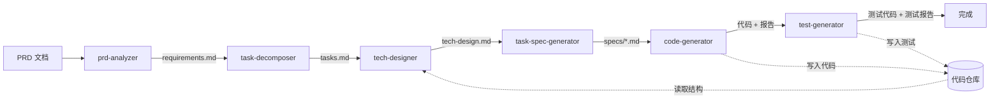

# AIWorkFlow

将「从 PRD 到代码」拆解为一组可审核、可追踪、可修订的 AI 辅助开发阶段。

## 工作流



每个阶段产出中间文档，通过人工审核逐步收敛不确定性，不跳过、不一次性从 PRD 直出代码。

## 快速开始

```bash
# 安装到指定平台
./install.sh cursor    # Cursor
./install.sh hermes    # Hermes Agent
./install.sh           # 所有平台

# 在 AI 对话中使用
# 1. 执行 workflow-init，按提示填写项目信息
# 2. 进入生成的 workflow-xxx 目录，按顺序执行各阶段
```

## 目录结构

```
AIWorkFlow/
├── install.sh                    # 统一安装入口
├── platforms/                    # 各平台安装脚本
│   ├── cursor/
│   ├── hermes/
│   └── openclaw/
├── skills/                       # Skill 定义
│   ├── workflow-init/SKILL.md
│   │   └── AGENT.md                    ← 默认 Agent 角色配置
│   ├── dev-profile/SKILL.md
│   ├── prd-analyzer/SKILL.md
│   ├── task-decomposer/SKILL.md
│   ├── tech-designer/SKILL.md
│   ├── task-spec-generator/SKILL.md
│   ├── code-generator/SKILL.md
│   └── test-generator/SKILL.md  （待实现）
└── docs/
    └── ai-workflow-best-practices.md
```

安装后在项目目录生成的工作流目录结构：

```
workflow-{项目名称}/
├── workflow.yaml          # 配置文件（各阶段的唯一配置入口）
├── AGENT.md               # Agent 角色与项目约束（按需修改后执行 dev-profile 加载）
└── output/
    ├── requirements.md    # 需求分析
    ├── tasks.md           # 任务分解
    ├── tech-design.md     # 技术方案
    ├── specs/             # 开发规格
    │   ├── README.md
    │   └── T-XXX-spec.md
    └── generated/         # 代码生成报告
        ├── T-XXX-report.md      # 代码生成报告
        └── T-XXX-test-report.md # 测试生成报告
```

## 各阶段说明

| 阶段 | 输入 | 输出 | 核心职责 |
|------|------|------|----------|
| `workflow-init` | 用户交互 | `workflow.yaml` + `AGENT.md` | 收集项目信息，初始化工作流目录，生成默认 Agent 角色配置 |
| `dev-profile` | `AGENT.md` | 上下文注入 | 读取 Agent 角色和项目约束，注入当前会话上下文 |
| `prd-analyzer` | PRD 文档 | `requirements.md` | 提取结构化需求，平台过滤，发现待澄清项 |
| `task-decomposer` | 已确认的需求 | `tasks.md` | 拆解开发任务，建立依赖关系并排序 |
| `tech-designer` | 任务 + 真实代码库 | `tech-design.md` | 基于真实代码设计数据结构、流程、影响范围 |
| `task-spec-generator` | 技术方案 | `specs/*.md` | 收敛为逐文件逐修改点的可执行规格 |
| `code-generator` | 单个任务规格 | 代码 + 生成报告 | 按修改点生成/修改项目代码 |
| `test-generator` | 任务规格 + 已生成代码 | 测试代码（写入代码仓库） + 测试报告 | 基于规格和代码生成单元测试 |

## 核心理念

- **逐阶段收敛**：每个阶段减少不确定性，不跨阶段跳步
- **人工审核门禁**：每阶段产物需确认后才进入下一阶段
- **来源可追溯**：需求 → 任务 → 方案 → 规格 → 代码，完整链路可追踪
- **修订可收敛**：每阶段支持人工审核后修订，所有待澄清项解决后自动收敛为已确认
- **一次只做一个**：code-generator 每次处理一个任务规格，不批量生成
