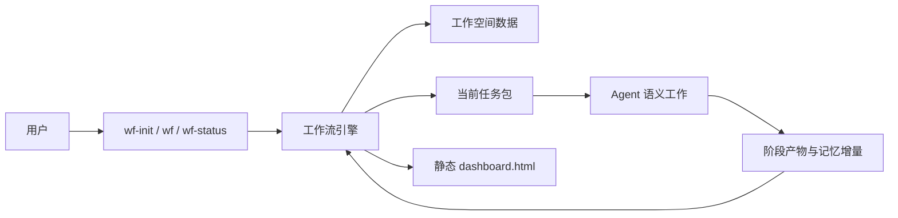
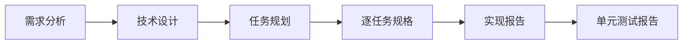
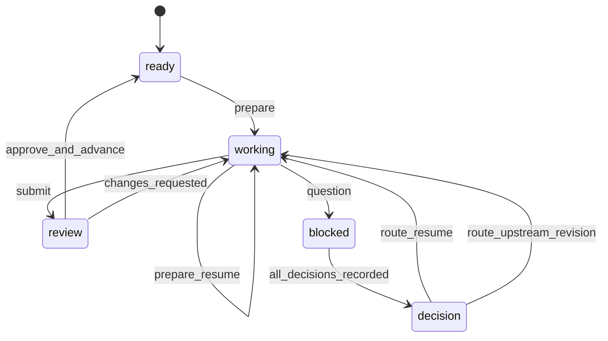

# AIWorkFlow 重构技术方案

## 文档状态

- 状态：已批准
- 批准日期：`2026-08-25`
- 基线提交：`836c9d3`
- 实施目录：`/Users/cm/GitProj/AIWorkflow/wf-develop`
- 线上保护目录：`/Users/cm/GitProj/AIWorkflow/wf-release`
- 原则：本方案和后续实现只允许修改 `wf-develop`，不得修改 `wf-release`

## 1. 背景

当前 AIWorkFlow 已具备完整的工作空间、阶段推进、人工审核、问题处理、修订收敛、状态校验和静态看板能力，但大量流程规则同时存在于 `SKILL.md`、运行时说明、门禁、能力文件、产物契约、校验器和测试中。

这套结构提高了格式一致性，却使 Agent 在执行需求分析、技术设计和代码任务时需要持续关注框架规则。Agent 容易把主要精力用于满足模板、维护状态和规避校验，而不是理解业务目标、识别需求冲突和形成高质量方案。

本次重构的目标不是取消流程，而是让流程退到后台：Agent 负责高自由度的语义工作，确定性程序负责低自由度的状态和数据管理。

## 2. 重构目标

### 2.1 核心目标

1. 降低框架规则对 Agent 上下文和注意力的占用。
2. 提升需求分析对业务目标、关键行为、隐含约束和冲突的理解质量。
3. 保留当前已经形成使用习惯的交互入口和五阶段流程。
4. 让任意新会话都能从工作空间恢复整体需求记忆和已确认决策。
5. 将状态、编号、审核、依赖、版本、历史和网页生成下沉到确定性工具。
6. 保留用户可读的 Markdown 语义产物和静态 `dashboard.html`。

### 2.2 必须保留的外部行为

- 保留 `wf-init`、`wf`、`wf-status` 三个入口。
- 保留工作空间创建和从工作空间继续流程的交互方式。
- 保留以下五个核心阶段及其顺序：
  1. 需求分析
  2. 技术设计
  3. 任务规格
  4. 代码实现
  5. 单元测试
- 保留阶段产物提交后等待用户审核的推进方式。
- 保留用户提出问题、做出决策和要求修改的能力。
- 保留动态数据与静态网页结合的检视方式。
- 保留流程可暂停、可恢复、可追溯的能力。

### 2.3 非目标

- 不兼容、不识别或迁移旧工作空间；旧项目需要在新的空目录中重新初始化。
- 不保留旧校验器的每一条正则规则。
- 不在新内核中复刻当前 `CONTEXT.md`、`ISSUES.md`、`REVISIONS.md`、`JOURNAL.md` 和 `CHANGELOG.md` 的组织方式。
- 不增加新的业务阶段。
- 不在重构期间修改或试运行 `wf-release`。

## 3. 设计原则

### 3.1 薄 Skill

三个 `SKILL.md` 只描述入口职责、调用顺序、必要安全边界和失败处理，不复述数据结构、状态机和产物格式。

### 3.2 强工具

以下工作全部由 Python 工具完成：

- 工作空间初始化
- 状态读取
- ID 分配
- 产物注册和版本递增
- 审核状态更新
- 上下游依赖和失效
- 决策与事件记录
- 任务包生成
- 原子写入
- 静态网页渲染

### 3.3 语义产物与流程元数据分离

Markdown 只承载需求、设计、规格、实现和测试语义。审核人、审核时间、修订号、状态和依赖关系存入 `.aiwf/` 下的结构化数据。

### 3.4 渐进披露

每次 `wf` 只向 Agent 提供：

- 当前阶段目标
- 项目长期记忆
- 已确认决策
- 当前任务相关上游产物
- 当前用户指令或审核反馈
- 少量不可违反的边界

不得默认加载完整框架说明、完整历史或无关任务产物。

### 3.5 规则按自由度分层

| 类型 | 责任方 | 示例 |
|---|---|---|
| 高自由度语义判断 | Agent | 理解需求、识别冲突、设计方案、实现代码 |
| 中自由度阶段指导 | 阶段参考文件 | 最低交付内容、质量启发、何时询问用户 |
| 低自由度确定性规则 | 工作流引擎 | 状态、编号、版本、依赖、原子写入、渲染 |

### 3.6 不依赖聊天记忆

同一会话中的上下文可以利用，但工作流必须假设下一次执行的 Agent 没有任何聊天记忆。所有跨会话必需事实必须持久化到工作空间。

## 4. 目标架构



### 4.1 运行单元

- 三个 Skill 是用户入口。
- 一个共享 Python 工作流引擎是确定性内核。
- 五份阶段参考文件提供最小语义指导。
- 一个渲染器读取结构化状态和 Markdown 产物生成静态网页。

### 4.2 建议的最终代码结构

```text
wf-develop/
├── wf/
│   ├── SKILL.md
│   ├── references/
│   │   └── stages/
│   │       ├── analysis.md
│   │       ├── design.md
│   │       ├── specification.md
│   │       ├── implementation.md
│   │       └── testing.md
│   └── tools/
│       ├── aiwf.py
│       └── aiwf_core/
│           ├── model.py
│           ├── storage.py
│           ├── workflow.py
│           ├── context.py
│           ├── stage_context.py
│           ├── stage_guides.py
│           ├── artifacts.py
│           ├── decisions.py
│           ├── decision_flow.py
│           ├── sources.py
│           ├── repository.py
│           ├── file_roles.py
│           ├── operation_policy.py
│           ├── review.py
│           ├── health.py
│           ├── dashboard.py
│           └── memory_view.py
├── wf-init/
│   └── SKILL.md
├── wf-status/
│   └── SKILL.md
└── tests/
    ├── unit/
    ├── integration/
    └── evaluations/
```

`wf` 是共享内核的所有者。`wf-init` 和 `wf-status` 是薄入口，并把调用委托给同一套内核，不再复制校验器。
`workflow.py` 负责编排用例，`decision_flow.py` 负责问题规范化、决定完整性和上游路由策略，`stage_context.py` 负责五阶段任务上下文，`stage_guides.py`
装载当前阶段的确定性指导，`operation_policy.py` 统一操作门禁，`repository.py` 与
`file_roles.py` 负责仓库会话和高置信文件职责。事实校验按 artifact、decision、source、
repository 和 health 分模块；`dashboard.py` 与 `memory_view.py` 分别生成看板和记忆投影。

当前实现直接维护上述 develop 正式路径。重构过程中的临时实现目录已经删除，不属于现行架构、
验证边界或发布流程。

三个入口作为同一发行单元安装。`wf-init` 和 `wf-status` 通过自身真实路径定位同级
`wf/tools/aiwf.py`；不得依赖当前工作目录、线上软链接路径或写死本机绝对路径。找不到
共享内核时应直接返回安装不完整错误，不回退到复制的工具实现。

## 5. 新工作空间结构

```text
workspace/
├── .aiwf/
│   ├── project.json
│   ├── state.json
│   ├── requirements.json
│   ├── tasks.json
│   ├── artifacts.json
│   ├── decisions.json
│   ├── questions.json
│   ├── events.jsonl
│   ├── memory.json
│   ├── memory.md
│   ├── results/
│   ├── history/
│   ├── work/
│   ├── transactions/
│   └── workspace.lock
├── prd/
├── artifacts/
│   ├── analysis.md
│   ├── design.md
│   ├── specs/
│   │   └── T-001.md
│   ├── reports/
│   │   └── T-001.md
│   └── tests/
│       └── T-001.md
└── dashboard.html
```

### 5.1 `project.json`

保存初始化后相对稳定的项目配置。`code_repository` 是必填的已解析绝对目录，初始化在写入任何
工作空间文件前验证其存在且为目录；不提供后补或修改仓库配置的命令：

```json
{
  "schema_version": 9,
  "project_id": "demo-project",
  "name": "Demo Project",
  "platform": "HarmonyOS",
  "code_repository": "/absolute/path/to/repository",
  "prd_files": ["prd/requirements.md"],
  "created_at": "2026-08-25T10:00:00+08:00"
}
```

### 5.2 `state.json`

只保存当前工作流状态，不复制产物正文：

```json
{
  "schema_version": 9,
  "current_stage": "analysis",
  "mode": "ready",
  "active_item": null,
  "active_work": null,
  "active_work_sha256": null,
  "pending_reviews": [],
  "blocking_questions": [],
  "updated_at": "2026-08-25T10:00:00+08:00"
}
```

`current_stage` 取值：

- `analysis`
- `design`
- `specification`
- `implementation`
- `testing`
- `completed`

`mode` 取值：

- `ready`：可以准备当前阶段任务
- `working`：存在正在执行的任务
- `review`：等待用户审核
- `blocked`：等待用户决策或必要输入
- `decision`：问题已经全部回答，等待显式选择继续当前 work 或修订上游产物

复杂状态由 `current_stage + mode + active_item + active_work` 表达，不再创建大量组合状态名称。
`active_work_sha256` 保护引擎生成的任务包元数据；Agent 只允许修改任务包指定的草稿和结果文件。

### 5.3 `requirements.json`

保存需求的最小结构化索引，供追踪、任务关联和看板使用，不复制完整需求分析正文：

```json
{
  "schema_version": 9,
  "items": [
    {
      "id": "REQ-001",
      "title": "支持验证码登录",
      "summary": "用户可以通过手机号和验证码完成登录",
      "platform_scope": "target",
      "change_type": "new",
      "scope_reason": "验证码登录由目标移动端实现",
      "disposition": "proposed",
      "sources": [
        {"kind": "prd", "ref": "prd/requirements.md#验证码登录"}
      ],
      "origin_revision": 1
    }
  ]
}
```

`disposition` 取值：

- `proposed`：Agent 从 PRD 识别出的候选需求
- `accepted`：用户审核后纳入范围
- `deferred`：用户明确暂不纳入
- `excluded`：确认不属于目标端实施范围
- `withdrawn`：后续修订明确移除，但保留 ID 和审计记录

需求的完整行为、约束、证据和冲突保留在 `analysis.md`。结构化索引只承载跨阶段定位所需的最小字段。

需求第一次出现时由引擎分配 ID。分析修订任务包会返回已有需求 ID；Agent 对已有项回传
该 ID，对新增项不提供 ID。最新 revision 不再包含的候选项标记为 `withdrawn`，不得静默
删除或按标题猜测同一性。分析产物审核通过后，本 revision 中的 `proposed` 项转为
`accepted`。

### 5.4 `tasks.json`

保存任务规格阶段的 `task-plan` 产生的任务索引和依赖关系：

```json
{
  "schema_version": 9,
  "items": [
    {
      "id": "T-001",
      "title": "实现验证码登录状态管理",
      "requirements": ["REQ-001"],
      "depends_on": [],
      "status": "proposed",
      "origin_revision": 1
    }
  ]
}
```

任务状态取值：

- `proposed`：任务规划产物提出但尚未审核
- `planned`：`task-plan` 已审核，可以生成逐任务规格
- `in_progress`：规格已审核，正在实现或测试
- `implemented`：实现报告已审核
- `tested`：测试报告已审核
- `stale`：上游变更，需要重新评估
- `withdrawn`：后续任务规划修订明确移除，但保留 ID 和审计记录

任务 ID、依赖和完成状态由引擎管理。任务规划修订沿用与需求索引相同的显式 ID 规则；从最新
`task-plan` revision 移除的任务标记为 `withdrawn`，不复用其 ID。完整技术目标和方案仍保存在
`design.md` 以及对应规格中。每个活动任务至少引用一个 `accepted` 需求，并且所有
`accepted` 需求必须被至少一个活动任务覆盖；`deferred` 需求不进入任务设计。

### 5.5 `artifacts.json`

保存产物注册表和依赖关系：

```json
{
  "schema_version": 9,
  "items": [
    {
      "id": "T-001-spec",
      "type": "specification",
      "stage": "specification",
      "active_item": "T-001",
      "path": "artifacts/specs/T-001.md",
      "snapshot_path": ".aiwf/history/T-001-spec/2.md",
      "result_path": ".aiwf/results/T-001-spec/2.json",
      "work_path": ".aiwf/history/T-001-spec/2.work.json",
      "content_sha256": "...",
      "result_sha256": "...",
      "work_sha256": "...",
      "status": "review",
      "revision": 2,
      "approved_revision": 1,
      "depends_on": ["task-plan@2"],
      "sources": ["artifacts/design.md", "artifacts/task-plan.md"],
      "updated_at": "2026-08-25T10:30:00+08:00"
    }
  ]
}
```

产物状态：

- `review`
- `approved`
- `changes_requested`
- `stale`

未提交内容只存在于 `work/`，不进入产物注册表，因此不需要 `draft` 产物状态。

`snapshot_path` 指向当前 revision 提交时保存的不可变 Markdown 快照；正式 `path` 是当前展示投影。`approved_revision` 记录最近一次被用户审核通过的版本；当前 `revision` 更新后不会继承
旧版本的审核结论。审核意见、审核时间和操作者作为事件关联到明确 revision，注册表只保留
当前查询所需的摘要。

正式产物、Markdown 快照、结果清单和 revision 对应 work 快照的摘要必须与注册表哈希一致。发现工作流外修改时，`status` 只报告 `artifact_drift`；审核和阶段推进必须拒绝继续。用户明确选择后，`resolve-drift` 可以把孤立的正式 Markdown 修改作为新 work 草稿，或用已批准快照恢复正式产物。结果清单、work 或快照漂移不得通过 Markdown 反推或采纳。

### 5.6 `decisions.json`

保存用户已确认的原始决策，不只保留 Agent 摘要：

```json
{
  "schema_version": 9,
  "items": [
    {
      "id": "D-001",
      "question_id": "Q-001",
      "decision": "用户原始决策文本",
      "impact": ["analysis", "design"],
      "status": "active",
      "supersedes": [],
      "superseded_by": null,
      "created_at": "2026-08-25T11:00:00+08:00"
    }
  ]
}
```

### 5.7 `questions.json`

只记录真正需要用户输入才能安全继续的问题。每个问题必须说明：

- 当前缺失或冲突的事实
- 为什么 Agent 无法自行判断
- 影响哪些阶段或产物
- Agent 建议及其依据
- 当前状态

不因模板字段为空或形式不完整机械创建问题。

### 5.8 `events.jsonl`

采用追加写事件日志，每行一个 JSON 对象。事件用于审计和恢复，不要求 Agent维护日志文本。

核心事件包括：

- `workspace_initialized`
- `work_prepared`
- `artifact_submitted`
- `artifact_approved`
- `changes_requested`
- `question_opened`
- `decision_recorded`
- `work_superseded`
- `downstream_invalidated`
- `stage_advanced`
- `artifact_drift_resolved`
- `upstream_correction_routed`

`memory.md` 和 `dashboard.html` 是可重建视图，自动重建不写业务事件，避免展示行为污染审计日志。

### 5.9 `memory.json` 与 `memory.md`

`memory.json` 是长期记忆的结构化事实源，每条记录包含稳定 ID、受控类型、正文、证据、理由、
验证点、来源 artifact revision、状态和更新时间。`memory.md` 是引擎从 `memory.json` 与 `decisions.json` 生成的只读
可读投影，供 Agent 在新会话中快速恢复：

- 项目目标
- 当前范围和不在范围内的内容
- 关键术语
- 已确认业务事实
- 全局技术约束
- 已确认设计决策
- 当前主要风险
- 重要产物索引

只有用户决策或已审核产物中的跨阶段信息才能进入长期记忆。仓库事实、架构决策、工程默认值和
验证项分别保留其证据、理由或验证方式；推断、草稿和未确认结论不得写成已确认事实。
Agent 不直接编辑这两个文件，而是在结果清单中提交 `add`、`update` 或 `retract` 候选操作；
已有条目的修改必须引用稳定 memory ID，引擎只在审核通过时应用并重新生成 `memory.md`。

### 5.10 `results/`

保存每次阶段提交对应的不可变结构化结果清单：

```text
.aiwf/results/<artifact-id>/<revision>.json
```

产物注册表通过 `result_path` 指向当前 revision。结果清单保存候选记忆增量和索引更新所需
字段，使审核、修订对比和恢复不依赖解析 Markdown。旧 revision 的结果清单不覆盖、不删除。
`requirements.json` 和 `tasks.json` 是由引擎在提交事务中维护的当前索引，不是第二份语义正文。

## 6. 产物模型

### 6.1 产物分层

| 层级 | 内容 | 维护方 |
|---|---|---|
| 语义产物 | 需求、设计、任务规划、逐任务规格、实现报告、单元测试报告 | Agent |
| 流程元数据 | 状态、版本、依赖、审核、事件、决策 | 工作流引擎 |
| 展示产物 | `dashboard.html` | 渲染器 |

### 6.2 阶段提交清单

每次阶段提交由两部分组成：

1. 用户可读的 Markdown 语义产物。
2. 机器可读的最小结果清单。

结果清单只用于建立索引和依赖，不复制 Markdown 正文。引擎在 `prepare` 返回本阶段的
result schema，Agent 提交时按 schema 提供数据；引擎将校验后的清单不可变地保存到
`.aiwf/results/<artifact-id>/<revision>.json`。

不同阶段的结构化结果范围：

| 阶段 | 结构化结果 |
|---|---|
| 需求分析 | 目标平台、候选功能点、平台范围、变更类型、范围理由、处理建议、来源、候选记忆增量 |
| 技术设计 | 方案覆盖的已确认需求 ID、候选记忆增量 |
| 任务规划 | 任务标题、关联需求、任务硬依赖、候选记忆增量 |
| 逐任务规格 | 任务 ID、候选记忆增量 |
| 代码实现 | 任务 ID、变更文件、验证摘要、候选记忆增量 |
| 单元测试 | 任务 ID、单元测试文件、执行结果、未覆盖项、候选记忆增量 |

需求 ID、任务 ID、revision、时间和状态由引擎分配或规范化，Agent 不负责维护全局编号。
已有索引项的 ID 由 `prepare` 提供，Agent 只需显式回传关联；引擎不得通过标题相似度自行合并。

真正阻塞安全推进的问题不混入结果清单。Agent 应先调用 `question` 进入阻塞态，等待决策后
再完成并提交产物；不影响当前阶段完成的未知项作为风险或假设写入语义产物。

### 6.3 需求分析产物

路径：`artifacts/analysis.md`

最低语义要求：

- 需求目标和业务背景
- 目标平台以及本端范围与非范围
- 新增、修改、复用和无需实施的已有能力判断
- 原始依据和可追溯引用
- 关键用户或系统行为
- 已确认约束
- 冲突、缺失信息和合理推断
- 真正影响后续的待决策问题

不强制固定章节数量、固定表格或逐字段模板。Agent 应根据 PRD 类型决定分析结构和深度。

### 6.4 技术设计产物

路径：`artifacts/design.md`

最低语义要求：

- 方案目标和上下文
- 现状理解
- 核心设计和关键数据流
- 模块、文件、类、组件、接口和数据结构的职责边界
- 重要技术决策及权衡
- 影响范围、风险和验证思路

技术设计只负责架构与代码组织，不创建执行任务，不展开逐行正式代码；必要时可以使用伪代码。

图表按复杂度和表达价值决定，不要求机械生成固定类型的图；一旦需要流程图、类图、关系图、
架构图、时序图或状态图，必须使用以 `mermaid` 标记的 Markdown 围栏代码块绘制，确保 Markdown
产物和静态看板使用同一份可维护图表源。

### 6.5 任务规划与规格产物

任务规划路径：`artifacts/task-plan.md`

任务规划根据已批准技术设计拆分可独立编码的任务、目标、范围和硬依赖。提交 `task-plan`
后，任务先以 `proposed` 写入索引；只有该产物审核通过后才转为 `planned`，随后进入逐任务规格。

路径：`artifacts/specs/T-XXX.md`

最低语义要求：

- 当前任务目标
- 关联需求和设计决策
- 前置依赖
- 预期行为和边界
- 实现思路
- 预计修改范围
- 不得提前规定测试代码实现

规格应说明做什么、大致怎么做和达到什么目标，足以指导实现，但不要求 Agent 为满足模板重复设计内容。任务规划和逐任务规格都不得设计测试文件、用例、Mock 或断言。

### 6.6 实现报告

路径：`artifacts/reports/T-XXX.md`

最低语义要求：

- 实际修改内容
- 关键实现决策
- 与规格的差异及原因
- 已执行验证
- 未解决问题和风险

文件清单可以由工具根据代码仓库差异辅助生成，Agent 负责解释语义。

引擎不直接修改代码仓库。进入实现阶段时，`prepare` 记录仓库路径、可用的版本控制基线和
已存在的未提交文件；阶段参考要求 Agent 保护既有改动、只处理 active item、不得自行提交或
清理仓库。结果清单显式报告本次触碰的文件，不能把任务开始前已存在的差异冒充本次改动。
当前任务依赖其他任务时，任务包同时提供前置任务已批准实现报告的输入路径和精确 revision
依赖，不加载无关任务产物。

### 6.7 测试报告

路径：`artifacts/tests/T-XXX.md`

最低语义要求：

- 覆盖的关键行为
- 新增或修改的测试
- 执行方式和结果
- 未覆盖行为及原因
- 仍需关注的风险

单元测试代码设计来自真实实现和项目现有测试模式，不从规格中的模板化测试指令继承。

单元测试遵守与实现阶段相同的仓库边界。测试命令由 Agent 根据项目事实选择，结果清单记录
实际执行命令的摘要、退出状态和未执行原因；引擎不以“存在测试报告”替代真实测试结果。

### 6.8 版本和历史

- 每次提交产物时由引擎递增 `revision`。
- 当前版本保留在 `artifacts/`。
- 每次提交都把 revision Markdown 快照保存到 `.aiwf/history/<artifact-id>/<revision>.md`。
- 审核和修改意见通过事件关联到明确 revision。
- 用户审核的是指定 revision，不能把旧审核结果自动套用到新版本。

### 6.9 依赖和失效



上游已审核产物发生实质更新时，引擎根据 `depends_on` 将相关下游产物标记为 `stale`。失效只修改注册表状态，不要求 Agent 改写下游 Markdown 的审核字段。

## 7. 记忆和任务上下文

### 7.1 三层记忆

1. 对话记忆：当前会话中可利用，但不作为事实源。
2. 项目长期记忆：`memory.json` 与当前有效决策生成的完整可读投影 `memory.md`；完整 `decisions.json` 只用于状态、看板和审计。
3. 当前任务上下文：引擎按当前 work 的传递上游、当前产物历史来源和全部有效用户决定生成相关记忆投影，并直接内嵌到任务包。

### 7.2 任务包结构

`prepare` 返回机器可读任务包：

```json
{
  "work_id": "W-000001",
  "stage": "specification",
  "goal": "为 T-001 生成可实现规格",
  "active_item": "T-001",
  "target_platform": "HarmonyOS",
  "facts": {"requirements": [], "work_kind": "task_specification"},
  "memory_context": {"sha256": "...", "content": "# Project Memory\n..."},
  "inputs": [
    "artifacts/analysis.md",
    "artifacts/design.md",
    "artifacts/task-plan.md"
  ],
  "artifact": {"id": "T-001-spec", "type": "specification", "output": "artifacts/specs/T-001.md"},
  "draft_output": ".aiwf/work/W-000001/artifact.md",
  "result_output": ".aiwf/work/W-000001/result.json",
  "result_schema": {"$schema": "https://json-schema.org/draft/2020-12/schema", "...": "完整字段契约"},
  "result_seed": {"schema_version": 9, "stage": "specification", "task_id": "T-001", "memory_delta": [], "superseded_decisions": []},
  "stage_guide": {
    "id": "specification",
    "version": 1,
    "source": "references/stages/specification.md",
    "sha256": "...",
    "instructions": "# 任务规格\n..."
  },
  "constraints": [
    "不得替用户决定未确认业务选择",
    "不得修改任务范围外代码"
  ]
}
```

任务包只提供当前阶段指导、相关记忆、路径、目标、完整结果 JSON Schema、可填写 seed 和边界。`prepare` 将
`result_seed` 写入 `result_output`；seed 只是待填写起点，可以尚未满足最终 Schema，
`submit` 时必须符合 `result_schema`。Agent 不读取内核代码推断机器格式，并根据任务包读取内容，不把整个框架说明加载进上下文。
Agent 只写 `draft_output` 和 `result_output`，不直接覆盖正式产物或引擎数据。修订任务的草稿
由引擎从当前 revision 预填充；`submit` 在事务中保存新 revision 快照、提升草稿、保存结果清单并更新索引。
`work_id` 标识任务包和草稿生命周期，不承担底层事务编号职责。

### 7.3 记忆增量

Agent 提交阶段产物时，可以同时提交 `repository_fact`、`architecture_decision`、
`engineering_default` 或 `validation_item` 候选记忆增量。仓库事实必须带文件和符号证据，
架构决策必须带理由，工程默认值必须带理由和验证点，验证项必须说明验证方式。

每项增量都必须带操作类型、受控类型、内容和可选目标 memory ID，来源 artifact revision 由引擎附加。引擎只在对应产物审核通过
或用户明确确认后应用；无法定位目标、来源 revision 不匹配或相互冲突时拒绝事务，不做
语义猜测。

未批准产物被要求修改时，原候选记忆增量继续保留；已批准产物创建新 revision 时，历史增量
已经生效，不得重放，新 seed 的 `memory_delta` 为空。任务包通过 `facts.affected_memory` 提供
该产物历史 revision 产生的活动记忆，由 Agent 判断是否需要显式 `update` 或 `retract`。如果
产物正文、Agent 结果字段、记忆增量和精确 revision 依赖均未改变，`submit` 拒绝创建空 revision。

## 8. 工作流引擎

### 8.1 内部命令

```text
aiwf.py init       初始化工作空间
aiwf.py recover    显式恢复未完成事务和生成视图
aiwf.py prepare    生成当前任务包
aiwf.py submit     注册产物和候选记忆增量
aiwf.py review     处理审核通过或修改意见
aiwf.py revise     修订已批准的明确 revision
aiwf.py resolve-drift 采纳或放弃工作流外的正式 Markdown 修改
aiwf.py question   登记阻塞问题
aiwf.py decide     原样保存用户决策
aiwf.py route-decision 根据决定继续当前 work 或修订上游产物
aiwf.py status     输出结构化状态
aiwf.py render     生成 dashboard.html
```

这些是 Skill 内部调用接口，不要求用户直接记忆或执行。

`submit` 同时接收任务包中的 Markdown 草稿和阶段结果清单。引擎只从结果清单更新需求、任务、
依赖和状态索引，不通过解析 Markdown 标题或表格恢复机器状态。引擎按命令自然键保证重试
幂等：`prepare` 使用 active work，`submit/question` 使用 work ID，`review` 使用 artifact ID、
revision 和结果，`decide` 使用 question ID，`route-decision` 使用 decision work ID。相同请求重试必须返回同一结果，不能重复分配 ID、
递增 revision 或追加事件；同一自然键出现冲突内容时必须拒绝。

一个 work 只允许一个终结动作：成功 `submit`，或一次性登记本轮全部阻塞问题后进入
`blocked`。全部问题解决后进入 `decision`，但不自动恢复原任务。`route-decision resume`
创建 successor work 并复制未提交草稿；`route-decision revise` 只允许选择问题影响范围内、
且属于当前 work 传递上游依赖的已批准 revision，并在同一事务中归档当前 work、创建上游
revision work。引擎不从用户自然语言猜测路由。

### 8.2 事务模型

每个写操作先获取工作空间级排他锁，再遵循：

1. 读取并校验当前 schema 和状态。
2. 判断请求是否符合当前阶段和模式。
3. 生成内部 transaction ID，在 `.aiwf/transactions/<transaction-id>/` 写入受影响文件的 before image、after image 和事务清单。
4. 完成所有 after image 的 schema、引用和路径校验并将事务标记为 `prepared`。
5. 按事务清单替换正式文件、追加带 transaction ID 和命令自然键的事件并将事务标记为 `committed`。
6. 校验提交结果后清理事务目录。
7. 释放锁，再 best-effort 重新渲染网页。

正式语义产物也属于该事务：提交时把新 revision 的 Markdown 快照和 work 快照写入 `history/`，
再把 `work/` 中草稿提升到正式路径并登记内容哈希。Agent 在 `work/` 中的未提交草稿不作为流程事实；它会在
幂等恢复期间保留，work 完成或明确放弃后才清理。

每个写命令开始时先恢复未完成事务：`prepared` 事务依据事件中的 transaction ID 和命令自然键完成提交或用
before image 回滚，尚未 `prepared` 的事务直接清理。由此保证命令失败或进程中断后可以恢复到
完整的提交前或提交后状态，而不是依赖多次文件替换天然原子。

普通写命令只自动恢复事务，不静默重建发生漂移的生成视图。`recover` 与显式 `render` 才会按
结构化事实源重建 `memory.md` 和看板，使直接 Engine 调用与 CLI 具有同一恢复语义。

`status` 只获取共享读锁且绝不执行恢复或渲染；发现未完成事务时返回 `needs_recovery`，由
下一次 `wf` 写操作执行恢复。网页渲染失败不回滚已经完成的数据事务，但必须返回清晰错误。

### 8.3 状态迁移

通用阶段循环：



`prepare` 在 `working` 模式下幂等返回 active work 的同一任务包，用于会话中断后恢复。
`changes_requested` 会保留 active item、创建新 work 并用当前 revision 预填草稿，使当前调用
可以继续修改；`decision_recorded` 只更新决定、记忆投影和模式，`decision_route_selected`
负责创建 successor work 或上游 revision work。若调用中断，状态仍明确停留在 `decision` 或
新的 `working`，不会在用户未选择路由时擅自继续原任务。

### 8.4 健康门禁

`status` 为每个 issue 返回 `blocking` 与 `recovery_action`，并给出顶层 `can_advance`。
存在阻塞错误时 `next_action=resolve_health_issues`，Engine 在独占锁内拒绝正常 `prepare`、`submit` 以及
decision resume，但继续允许 `status`、`recover`、`resolve-drift`、记录用户决定和创建上游
revision。批准审核在内核独占事务中校验当前结构健康和批准后的语义投影，不能被该审批将要
消除的合法过渡态反向阻塞。生成视图漂移走确定性恢复，产物漂移走显式采纳或放弃，索引覆盖
错误走对应上游 revision，仓库不可访问时要求恢复初始化时保存的绝对路径。

分析和设计阶段的唯一产物审核通过后推进到下一阶段。规格阶段先生成并审核唯一的
`task-plan`，再按其中的活动任务逐个生成规格；实现和测试阶段同样按任务逐个执行。
单项审核通过后，如果仍有可执行项则保持当前阶段并回到 `ready`，只有本阶段所有非 withdrawn
任务的对应产物都 `approved` 才推进。默认一次只允许一个 active item，避免并发 Agent 修改同一
工作空间；未来若需要并行处理，必须单独设计租约和合并协议。

work 进入阻塞态时记录仓库 pause checkpoint 和此前已归属变化；恢复时仅把不重叠的等待期变化
吸收到新 baseline，已归属文件被外部修改或 Git HEAD 改变时返回冲突。实现和测试提交还会按
仓库现有路径惯例执行高置信文件角色检查；不明确的配置、资源和非标准路径保留给 Agent 判断。

## 9. 三个 Skill 的职责

### 9.1 `wf-init`

只负责：

- 校验当前目录是否可以初始化
- 收集项目名称、平台、PRD 路径和代码仓库路径
- 将确认后的 PRD 文件复制到工作空间 `prd/`，后续只引用副本
- 调用 `aiwf.py init`
- 输出初始化结果和下一步

不在 `SKILL.md` 中嵌入完整模板和平台编码规范。项目编码规范从初始化时必填的代码仓库事实中读取。

### 9.2 `wf`

只负责：

- 识别用户是在继续、审核、修改、提问还是决策
- 调用工作流引擎得到当前状态或任务包
- 按任务包执行当前语义工作
- 提交产物、问题或审核反馈
- 输出结果和下一步

`wf` 不手工维护状态文件、ID、事件、版本和依赖。

### 9.3 `wf-status`

只负责：

- 调用 `aiwf.py status`
- 将结构化结果转换为简洁对话输出
- 在用户要求详细检查时展示引擎返回的问题

不复制工作流校验规则，不写入任何工作空间文件。

## 10. 阶段参考文件

每份阶段参考文件只包含四部分：

1. 本阶段要解决的问题。
2. 建议关注的事实和推理维度。
3. 必须交付的最低语义内容。
4. 何时必须停止并请求用户决策。

参考文件不包含：

- 状态迁移说明
- 审核字段格式
- ID 和排序规则
- 日志写入规则
- 网页渲染规则
- 与当前阶段无关的其他阶段模板

## 11. 静态网页

### 11.1 数据来源

渲染器只读取：

- `.aiwf/project.json`
- `.aiwf/state.json`
- `.aiwf/requirements.json`
- `.aiwf/tasks.json`
- `.aiwf/artifacts.json`
- `.aiwf/questions.json`
- `.aiwf/decisions.json`
- `.aiwf/events.jsonl`
- `.aiwf/memory.json`
- `.aiwf/memory.md`
- `artifacts/**/*.md`

不得从 Markdown 正文反向推断审核状态或阶段状态。

### 11.2 页面区域

- 项目概要
- 五阶段进度
- 当前行动和待审核项
- 需求与任务追踪
- 产物列表和版本状态
- 阻塞问题和用户决策
- 项目长期记忆
- 最近事件
- Markdown 产物预览

### 11.3 实现策略

- 继续生成单文件 `dashboard.html`。
- 不启动本地服务。
- 不从页面写回工作空间。
- 不加载远程脚本或样式；Markdown 和结构化字段在嵌入页面前必须转义或经过安全白名单渲染。
- 可以复用旧页面成熟的视觉样式，但不复用旧 Markdown 状态解析逻辑。
- 渲染器优先保持简单，页面展示功能不反向影响核心数据模型。

## 12. 审核、修改和决策

### 12.1 审核通过

- 用户明确指定或当前仅有一个待审核产物时允许审核。
- 引擎将指定 revision 标记为 `approved`。
- 对应候选记忆增量合并进长期记忆。
- 当阶段完成条件满足时推进到下一阶段。

### 12.2 修改意见

- 用户反馈原文作为事件关联到目标 artifact revision。
- 产物状态改为 `changes_requested`。
- 下一次任务包包含原产物、用户反馈和相关上游事实。
- 新版本提交后重新进入 `review`。

### 12.3 阻塞问题

- 只有 Agent 无法基于现有事实安全推进时才创建问题。
- 问题必须关联当前阶段、任务和受影响产物。
- 用户决策原文写入 `decisions.json`。
- 全部问题回答后显式选择 `route-decision resume/revise`；恢复当前 work 或创建真正受影响的上游 revision work。

## 13. 旧工作空间边界

新内核只识别由当前 `wf-init` 创建、包含 `.aiwf/` 的工作空间。对于旧格式目录，`wf` 和
`wf-status` 返回 `not_initialized` 后停止，不扫描旧状态文件，不转换产物，也不提供迁移、
备份或双格式兼容命令。需要继续旧项目时，由用户在新的空目录中通过 `wf-init` 重新初始化。
任何低于当前版本的工作空间都不做升级或迁移，直接拒绝并要求重新初始化。

## 14. 测试与质量评价

### 14.1 单元测试

- JSON 数据模型校验
- 需求索引和任务索引
- 阶段结果清单校验
- 状态迁移
- ID 分配
- 原子写入
- 写锁、命令幂等和中断事务恢复
- 产物版本递增
- 草稿提升、revision 快照和内容哈希漂移检测
- 审核指定 revision
- 依赖失效
- 记忆合并
- 事件追加

### 14.2 集成测试

- `wf-init` 创建完整工作空间
- `prepare -> submit -> review` 通用事务
- 中断后重复 `prepare/submit` 不产生重复 ID、revision 或事件
- Markdown 产物与结构化结果清单联合提交
- 阻塞问题和决策恢复
- 用户修改后产生新 revision
- 工作流外修改正式产物后拒绝沿用旧审核状态
- 上游变化使下游变为 `stale`
- `wf-status` 不写文件
- 渲染器生成完整网页

### 14.3 五阶段场景测试

使用最小代码仓库和 PRD 夹具执行：

1. 初始化
2. 需求分析与审核
3. 技术设计与审核
4. 多任务规格与审核
5. 单任务实现与审核
6. 单元测试与审核
7. 流程完成
8. 新会话恢复状态

### 14.4 需求分析质量评价

结构测试不能证明需求分析质量提升。需要选择具有代表性的真实 PRD，对新旧结果进行对比评价：

- 业务目标理解是否准确
- 关键行为是否完整
- 隐含约束是否被识别
- 冲突和缺失是否被发现
- 是否区分事实、推断和待决策项
- 提问是否真正阻塞后续
- 产物是否能有效支撑技术设计
- Agent 是否把主要篇幅用于语义内容而不是框架字段

质量评价应使用原始 PRD、产物和评价量表，不向评价者泄露预期答案。

## 15. 分阶段实施计划

### 阶段 0：方案基线

实施状态：已完成（`397c47f`）。

目标：确认重构目标、架构、数据模型、产物模型和验收方式。

产出：

- 本技术方案
- 待决策项清单
- 初始目标追踪矩阵

退出条件：

- 用户审核通过技术方案
- 所有影响架构的待决策项已确认或明确延期

### 阶段 1：新内核骨架和测试基建

实施状态：已完成。

目标：建立新代码结构、CLI 骨架、测试目录和工作空间夹具。

产出：

- `aiwf.py` 命令入口
- `aiwf_core` 包结构
- 基础测试工具和场景夹具
- develop 正式路径与 release 路径之间的隔离检查
- release 保护检查

退出条件：

- CLI 可以输出帮助和结构化错误
- 测试可以在临时目录运行
- `git diff -- wf-release` 为空

### 阶段 2：数据内核

实施状态：已完成。

目标：完成项目、状态、产物、决策、问题、事件和记忆的存储模型。

产出：

- 数据模型
- 需求索引、任务索引和阶段结果 schema
- revision 级结果清单存储和索引调和
- work 草稿区、正式产物提升和历史归档
- 原子存储
- 工作空间写锁、命令幂等和事务恢复
- 状态迁移
- 产物注册、版本和失效
- 单元测试

退出条件：

- 所有核心数据操作有测试
- 失败或中断事务可恢复到完整提交前或提交后状态
- 正式产物或结果清单漂移时不能审核或推进
- 状态可以从持久化数据重新加载

### 阶段 3：初始化与状态入口

实施状态：已完成。

目标：先打通不依赖语义生成的 `wf-init` 和 `wf-status`。

产出：

- 新 `wf-init/SKILL.md`
- 新 `wf-status/SKILL.md`
- 初始化和状态集成测试

退出条件：

- 空目录可初始化
- 初始化数据符合 schema
- `wf-status` 只读
- 新会话可以读取当前状态

### 阶段 4：需求分析纵向切片

实施状态：实现已完成。需求分析入口、阶段参考、CLI 闭环、长期记忆合并和两份真实 PRD
质量样本已完成；按用户决定，新旧分析结果的独立质量对比统一放到阶段 8 综合验证执行。

目标：优先验证本次重构最核心的需求分析质量目标。

产出：

- 新 `wf/SKILL.md` 最小入口
- `analysis.md` 阶段参考
- `prepare/submit/review` 分析流程
- 长期记忆首次合并
- 需求分析质量评价样本

退出条件：

- Agent 任务包不包含无关框架规则
- 分析产物可以自由组织但满足最低语义要求
- 用户审核后进入技术设计
- 新会话可以恢复已确认需求理解
- 与旧版本相比没有明显质量退化（阶段 8 统一验证）

### 阶段 5：技术设计与规格

实施状态：实现已完成；效果验收按用户决定统一放到阶段 8 执行。

目标：打通需求到设计、设计到任务规格的语义链路。

产出：

- 设计阶段参考
- 规格阶段参考
- `task-plan` 任务规划产物
- 任务 ID 和依赖管理
- 多规格审核与阶段完成逻辑

退出条件：

- 设计引用已确认需求和决策
- 设计基于真实代码，只负责架构和代码组织
- 任务由批准后的设计在规格阶段拆分
- 每个任务规格可追溯到设计与需求
- 任务规划和逐任务规格均不包含单元测试设计
- 上游修订能使相关规格失效

### 阶段 6：代码实现与单元测试

实施状态：实现已完成；效果验收按用户决定统一放到阶段 8 执行。

目标：完成两个会修改代码仓库的阶段。

产出：

- 实现阶段参考
- 单元测试阶段参考
- 实现报告和单元测试报告登记
- 代码改动范围记录
- 测试执行适配接口

退出条件：

- 实现只读取当前任务所需上下文
- 实际偏离得到清晰记录
- 测试基于真实实现和项目现有模式
- 任务和整个流程完成条件正确

### 阶段 7：静态网页

实施状态：实现已完成；视觉与使用效果验收按用户决定统一放到阶段 8 执行。

目标：完成基于新数据模型的静态检视页面。

产出：

- 新渲染器
- 页面布局和预览
- 网页快照测试

退出条件：

- 页面不解析 Markdown 状态字段
- 五阶段、产物、问题、决策和事件展示正确
- 页面生成失败不破坏工作流数据

### 阶段 8：综合验证与切换

实施状态：重构实现与审查收口修复已完成，develop 正式目录切换已完成；按用户决定，最终效果验收由用户统一执行，在验收通过前版本保持候选发布状态。旧工作空间兼容能力已按最新范围决定删除。

目标：完成 develop 内正式入口替换和综合验证。

产出：

- 完整端到端测试
- 新旧需求分析对比报告
- develop 正式目录结构

退出条件：

- 三个入口和五阶段验收通过
- 新会话恢复测试通过
- 真实 PRD 质量评价达到预期
- develop 正式入口与共享内核安装定位验证通过
- 被替代旧实现已删除
- 恢复、已批准产物修订、结果契约和生成视图读写闭环
- release 仍无任何改动

## 16. 初始目标追踪矩阵

| 编号 | 初始目标 | 设计响应 | 验收证据 |
|---|---|---|---|
| G-001 | Agent 更专注需求理解 | 薄 Skill、阶段任务包、自由语义产物 | 任务包审查、真实 PRD 对比 |
| G-002 | 保留三个入口 | 三个薄 Skill 委托同一内核 | 入口场景测试 |
| G-003 | 保留五阶段 | 固定五阶段和通用阶段循环 | 五阶段端到端测试 |
| G-004 | 保留工作空间推进方式 | `prepare/submit/review` 驱动状态 | 流程恢复与审核测试 |
| G-005 | 保留动态数据与静态网页 | `.aiwf/` + Markdown + `dashboard.html` | 渲染器测试和页面检查 |
| G-006 | 跨会话保持整体需求记忆 | `memory.json`、`memory.md`、决策原文、动态任务包 | 新会话恢复测试 |
| G-007 | 规则退到后台 | 状态、版本、依赖和历史下沉引擎 | Skill 内容审查、工具测试 |
| G-008 | release 不受重构影响 | 所有工作限定 `wf-develop` | 每阶段 release diff 检查 |

## 17. 风险与控制

### R-001：新内核再次变成复杂框架

控制：新增规则必须先判断能否由程序确定性处理；能下沉的规则不得写入 Agent 指令。

### R-002：任务包过度压缩导致上下文缺失

控制：任务包始终包含长期记忆、已确认决策和可追溯输入路径；使用真实场景验证缺失情况。

### R-003：长期记忆摘要失真

控制：决策保存用户原文；记忆条目关联已审核产物；草稿和推断不进入长期事实。

### R-004：自由产物导致后续阶段无法使用

控制：每阶段保留最低语义要求，但不规定机械模板；通过跨阶段场景评价可用性。

### R-005：JSON 与 Markdown 不一致

控制：阶段 JSON 只保存索引、依赖、元数据和路径，不复制 Agent 产物正文；`memory.md` 是
`memory.json` 的单向生成视图。Markdown 产物和阶段结果清单通过单一引擎事务联合提交。
引擎不得通过解析 Agent 产物 Markdown 恢复机器状态。

### R-006：重构误改 release

控制：所有命令以 `wf-develop` 为工作目录；不使用 `git add .`；每个里程碑检查 `git diff -- wf-release`。

### R-007：旧格式兼容重新进入新内核

控制：命令面、数据模型和存储层均不保留旧格式识别、读取或转换分支；旧项目只能重新初始化。

### R-008：路径或产物内容越界

控制：工作空间内路径规范化后必须仍位于工作空间根目录；代码仓库路径单独授权且只在技术设计、
任务规格、实现和单元测试阶段使用；PRD 先复制再读取；网页渲染转义非可信内容且不加载远程代码。

## 18. 方案待确认项

### D-001：旧工作空间迁移时机

决定：`2026-08-26` 调整为不实现旧工作空间迁移。

原因：迁移收益极低，却会增加 Skill 入口、内核分支、数据模型兼容状态和测试维护成本。

### D-002：页面视觉复用范围

决定：采用建议。

建议：复用现有页面中经过验证的视觉样式和内容预览体验，重写全部数据解析和状态展示逻辑。

### D-003：需求分析质量样本

决定：采用建议。

建议：在阶段 4 开始前选择至少 2 份具有冲突、隐含约束或多模块影响的真实 PRD，作为新旧对比基线。

### D-004：长期记忆编辑权

决定：采用建议。

建议：采用 `memory.json` 为事实源、`memory.md` 为生成视图；Agent 只提交带来源和稳定 ID 的
候选增量，只有审核通过或用户明确确认后才应用。

## 19. 变更治理

实施过程中每个里程碑必须回答：

1. 本阶段解决了哪个初始目标？
2. 是否减少了 Agent 需要理解的框架内容？
3. 是否引入了可以下沉到工具的新规则？
4. 是否保持三个入口和五阶段不变？
5. 是否保留跨会话记忆？
6. 是否存在未记录的范围扩张？
7. `wf-release` 是否保持无差异？

新想法先记录为方案变更，不直接进入实现。改变初始目标、外部交互或五阶段流程必须先由用户确认。

每个稳定阶段单独提交，只暂存 `wf-develop/` 中明确列出的文件，不使用覆盖整个仓库的暂存命令。

## 20. 完成定义

满足以下条件才视为重构完成：

- 三个入口保持可用。
- 五阶段流程和人工审核方式保持可用。
- 新会话能依靠工作空间恢复整体上下文。
- Agent 不再手工维护流程状态、编号、版本、日志和失效关系。
- 五类语义产物可以支撑完整下游工作。
- 动态数据可以稳定生成单文件静态网页。
- 真实 PRD 对比表明需求分析没有退化，并在业务理解或有效提问方面得到改善。
- 新内核、三入口、五阶段、恢复、审核、修订、决策和网页测试全部通过。
- develop 正式目录中不再保留被替代的旧运行时结构。
- `wf-release` 从重构开始到完成始终没有被修改。

## 21. 当前实现状态

当前候选实现采用 Schema 9，不兼容或迁移任何旧 Schema。当前阶段指南与相关记忆直接内嵌到 work 包；所有推进门禁在 WorkflowEngine 独占锁内执行；实现和测试通过高置信文件角色阻止明确越界；仓库会话在阻塞前记录已归属变化，并在恢复时吸收不重叠的外部变化。完整项目记忆和看板仍是可重建投影，正常 Agent 上下文只接收当前 work 的相关记忆。

确定性流程、事务、恢复、版本、依赖、漂移和阶段边界由自动化测试验证。真实 PRD 的 release/develop 盲评仍是语义能力的最终验收；验收通过前保持候选发布状态。
