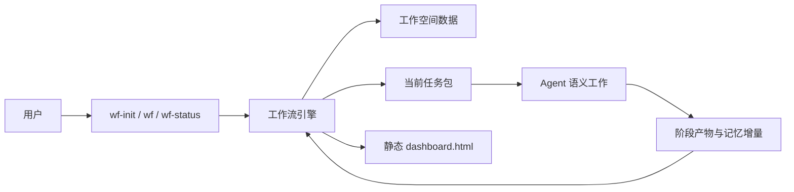
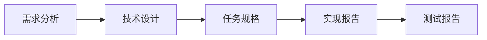
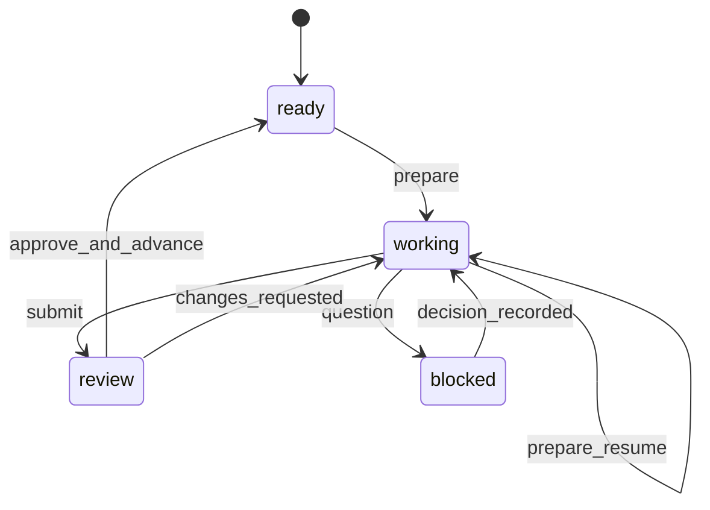

# AIWorkFlow 重构技术方案

## 文档状态

- 状态：已批准
- 批准日期：`2026-08-25`
- 基线提交：`836c9d3`
- 实施目录：`/Users/cm/GitProj/AIWorkflow/wf-develop`
- 线上保护目录：`/Users/cm/GitProj/AIWorkflow/wf-release`
- 原则：本方案和后续实现只允许修改 `wf-develop`，不得修改 `wf-release`

## 1. 背景

当前 AIWorkFlow 已具备完整的工作空间、阶段推进、人工审核、问题处理、修订收敛、状态校验和静态看板能力，但大量流程规则同时存在于 `SKILL.md`、运行时说明、门禁、能力文件、产物契约、校验器和测试中。

这套结构提高了格式一致性，却使 Agent 在执行需求分析、技术设计和代码任务时需要持续关注框架规则。Agent 容易把主要精力用于满足模板、维护状态和规避校验，而不是理解业务目标、识别需求冲突和形成高质量方案。

本次重构的目标不是取消流程，而是让流程退到后台：Agent 负责高自由度的语义工作，确定性程序负责低自由度的状态和数据管理。

## 2. 重构目标

### 2.1 核心目标

1. 降低框架规则对 Agent 上下文和注意力的占用。
2. 提升需求分析对业务目标、关键行为、隐含约束和冲突的理解质量。
3. 保留当前已经形成使用习惯的交互入口和五阶段流程。
4. 让任意新会话都能从工作空间恢复整体需求记忆和已确认决策。
5. 将状态、编号、审核、依赖、版本、历史和网页生成下沉到确定性工具。
6. 保留用户可读的 Markdown 语义产物和静态 `dashboard.html`。

### 2.2 必须保留的外部行为

- 保留 `wf-init`、`wf`、`wf-status` 三个入口。
- 保留工作空间创建和从工作空间继续流程的交互方式。
- 保留以下五个核心阶段及其顺序：
  1. 需求分析
  2. 技术设计
  3. 规格生成
  4. 代码实现
  5. 测试生成
- 保留阶段产物提交后等待用户审核的推进方式。
- 保留用户提出问题、做出决策和要求修改的能力。
- 保留动态数据与静态网页结合的检视方式。
- 保留流程可暂停、可恢复、可追溯的能力。

### 2.3 非目标

- 不保持旧工作空间内部文件格式逐字段兼容。
- 不保留旧校验器的每一条正则规则。
- 不在新内核中复刻当前 `CONTEXT.md`、`ISSUES.md`、`REVISIONS.md`、`JOURNAL.md` 和 `CHANGELOG.md` 的组织方式。
- 不增加新的业务阶段。
- 不把旧版本迁移逻辑混入核心阶段逻辑。
- 不在重构期间修改或试运行 `wf-release`。

## 3. 设计原则

### 3.1 薄 Skill

三个 `SKILL.md` 只描述入口职责、调用顺序、必要安全边界和失败处理，不复述数据结构、状态机和产物格式。

### 3.2 强工具

以下工作全部由 Python 工具完成：

- 工作空间初始化
- 状态读取和迁移
- ID 分配
- 产物注册和版本递增
- 审核状态更新
- 上下游依赖和失效
- 决策与事件记录
- 任务包生成
- 原子写入
- 静态网页渲染

### 3.3 语义产物与流程元数据分离

Markdown 只承载需求、设计、规格、实现和测试语义。审核人、审核时间、修订号、状态和依赖关系存入 `.aiwf/` 下的结构化数据。

### 3.4 渐进披露

每次 `wf` 只向 Agent 提供：

- 当前阶段目标
- 项目长期记忆
- 已确认决策
- 当前任务相关上游产物
- 当前用户指令或审核反馈
- 少量不可违反的边界

不得默认加载完整框架说明、完整历史或无关任务产物。

### 3.5 规则按自由度分层

| 类型 | 责任方 | 示例 |
|---|---|---|
| 高自由度语义判断 | Agent | 理解需求、识别冲突、设计方案、实现代码 |
| 中自由度阶段指导 | 阶段参考文件 | 最低交付内容、质量启发、何时询问用户 |
| 低自由度确定性规则 | 工作流引擎 | 状态、编号、版本、依赖、原子写入、渲染 |

### 3.6 不依赖聊天记忆

同一会话中的上下文可以利用，但工作流必须假设下一次执行的 Agent 没有任何聊天记忆。所有跨会话必需事实必须持久化到工作空间。

## 4. 目标架构



### 4.1 运行单元

- 三个 Skill 是用户入口。
- 一个共享 Python 工作流引擎是确定性内核。
- 五份阶段参考文件提供最小语义指导。
- 一个渲染器读取结构化状态和 Markdown 产物生成静态网页。

### 4.2 建议的最终代码结构

```text
wf-develop/
├── wf/
│   ├── SKILL.md
│   ├── references/
│   │   └── stages/
│   │       ├── analysis.md
│   │       ├── design.md
│   │       ├── specification.md
│   │       ├── implementation.md
│   │       └── testing.md
│   └── tools/
│       ├── aiwf.py
│       └── aiwf_core/
│           ├── model.py
│           ├── storage.py
│           ├── workflow.py
│           ├── context.py
│           ├── artifacts.py
│           ├── review.py
│           └── render.py
├── wf-init/
│   └── SKILL.md
├── wf-status/
│   └── SKILL.md
└── tests/
    ├── unit/
    ├── integration/
    ├── scenarios/
    └── evaluations/
```

`wf` 是共享内核的所有者。`wf-init` 和 `wf-status` 是薄入口，并把调用委托给同一套内核，不再复制校验器。

开发阶段不直接覆盖上述正式路径。阶段 1 至阶段 7 的新实现统一放在
`wf-develop/_rewrite/src/`，对应测试放在 `wf-develop/_rewrite/tests/`。只有阶段 8
综合验收通过后，才将新实现迁入 `wf-develop/wf`、`wf-develop/wf-init`、
`wf-develop/wf-status` 和 `wf-develop/tests`，再删除 develop 中被替代的旧实现。

三个入口作为同一发行单元安装。`wf-init` 和 `wf-status` 通过自身真实路径定位同级
`wf/tools/aiwf.py`；不得依赖当前工作目录、线上软链接路径或写死本机绝对路径。找不到
共享内核时应直接返回安装不完整错误，不回退到复制的工具实现。

## 5. 新工作空间结构

```text
workspace/
├── .aiwf/
│   ├── project.json
│   ├── state.json
│   ├── requirements.json
│   ├── tasks.json
│   ├── artifacts.json
│   ├── decisions.json
│   ├── questions.json
│   ├── events.jsonl
│   ├── memory.json
│   ├── memory.md
│   ├── results/
│   ├── history/
│   ├── work/
│   ├── transactions/
│   └── workspace.lock
├── prd/
├── artifacts/
│   ├── analysis.md
│   ├── design.md
│   ├── specs/
│   │   └── T-001.md
│   ├── reports/
│   │   └── T-001.md
│   └── tests/
│       └── T-001.md
└── dashboard.html
```

### 5.1 `project.json`

保存初始化后相对稳定的项目配置：

```json
{
  "schema_version": 1,
  "project_id": "demo-project",
  "name": "Demo Project",
  "platform": "HarmonyOS",
  "code_repository": "/absolute/path/to/repository",
  "prd_files": ["prd/requirements.md"],
  "created_at": "2026-08-25T10:00:00+08:00"
}
```

### 5.2 `state.json`

只保存当前工作流状态，不复制产物正文：

```json
{
  "schema_version": 1,
  "current_stage": "analysis",
  "mode": "ready",
  "active_item": null,
  "active_work": null,
  "active_work_sha256": null,
  "pending_reviews": [],
  "blocking_questions": [],
  "updated_at": "2026-08-25T10:00:00+08:00"
}
```

`current_stage` 取值：

- `analysis`
- `design`
- `specification`
- `implementation`
- `testing`
- `completed`

`mode` 取值：

- `ready`：可以准备当前阶段任务
- `working`：存在正在执行的任务
- `review`：等待用户审核
- `blocked`：等待用户决策或必要输入

复杂状态由 `current_stage + mode + active_item + active_work` 表达，不再创建大量组合状态名称。
`active_work_sha256` 保护引擎生成的任务包元数据；Agent 只允许修改任务包指定的草稿和结果文件。

### 5.3 `requirements.json`

保存需求的最小结构化索引，供追踪、任务关联和看板使用，不复制完整需求分析正文：

```json
{
  "schema_version": 1,
  "items": [
    {
      "id": "REQ-001",
      "title": "支持验证码登录",
      "summary": "用户可以通过手机号和验证码完成登录",
      "disposition": "proposed",
      "sources": ["prd/requirements.md#验证码登录"]
    }
  ]
}
```

`disposition` 取值：

- `proposed`：Agent 从 PRD 识别出的候选需求
- `accepted`：用户审核后纳入范围
- `deferred`：用户明确暂不纳入
- `needs_decision`：等待用户决策
- `withdrawn`：后续修订明确移除，但保留 ID 和审计记录

需求的完整行为、约束、证据和冲突保留在 `analysis.md`。结构化索引只承载跨阶段定位所需的最小字段。

需求第一次出现时由引擎分配 ID。分析修订任务包会返回已有需求 ID；Agent 对已有项回传
该 ID，对新增项不提供 ID。最新 revision 不再包含的候选项标记为 `withdrawn`，不得静默
删除或按标题猜测同一性。分析产物审核通过后，本 revision 中的 `proposed` 项转为
`accepted`。

### 5.4 `tasks.json`

保存技术设计产生的任务索引和依赖关系：

```json
{
  "schema_version": 1,
  "items": [
    {
      "id": "T-001",
      "title": "实现验证码登录状态管理",
      "requirements": ["REQ-001"],
      "depends_on": [],
      "status": "proposed"
    }
  ]
}
```

任务状态取值：

- `proposed`：设计产物提出但尚未审核
- `planned`：设计已审核，可以进入规格阶段
- `in_progress`：规格已审核，正在实现或测试
- `implemented`：实现报告已审核
- `tested`：测试报告已审核
- `deferred`：用户明确延期
- `stale`：上游变更，需要重新评估
- `withdrawn`：后续设计修订明确移除，但保留 ID 和审计记录

任务 ID、依赖和完成状态由引擎管理。设计修订沿用与需求索引相同的显式 ID 规则；从最新
revision 移除的任务标记为 `withdrawn`，不复用其 ID。完整技术目标和方案仍保存在
`design.md` 以及对应规格中。

### 5.5 `artifacts.json`

保存产物注册表和依赖关系：

```json
{
  "schema_version": 1,
  "items": [
    {
      "id": "T-001-spec",
      "type": "specification",
      "path": "artifacts/specs/T-001.md",
      "result_path": ".aiwf/results/T-001-spec/2.json",
      "work_path": ".aiwf/history/T-001-spec/2.work.json",
      "content_sha256": "...",
      "result_sha256": "...",
      "work_sha256": "...",
      "status": "review",
      "revision": 2,
      "approved_revision": 1,
      "depends_on": ["analysis@1", "design@2"],
      "sources": ["REQ-001", "REQ-003"],
      "updated_at": "2026-08-25T10:30:00+08:00"
    }
  ]
}
```

产物状态：

- `review`
- `approved`
- `changes_requested`
- `stale`

未提交内容只存在于 `work/`，不进入产物注册表，因此不需要 `draft` 产物状态。

`approved_revision` 记录最近一次被用户审核通过的版本；当前 `revision` 更新后不会继承
旧版本的审核结论。审核意见、审核时间和操作者作为事件关联到明确 revision，注册表只保留
当前查询所需的摘要。

正式产物、结果清单和 revision 对应 work 快照的摘要必须与注册表哈希一致。发现工作流外修改时，`status` 只报告
`artifact_drift`；审核和阶段推进必须拒绝继续。只有在用户明确要求采纳该修改后，`wf` 才能
把它作为新 work 的草稿重新提交为新 revision，不得沿用旧审核状态。

### 5.6 `decisions.json`

保存用户已确认的原始决策，不只保留 Agent 摘要：

```json
{
  "schema_version": 1,
  "items": [
    {
      "id": "D-001",
      "question_id": "Q-001",
      "decision": "用户原始决策文本",
      "impact": ["analysis", "design"],
      "created_at": "2026-08-25T11:00:00+08:00"
    }
  ]
}
```

### 5.7 `questions.json`

只记录真正需要用户输入才能安全继续的问题。每个问题必须说明：

- 当前缺失或冲突的事实
- 为什么 Agent 无法自行判断
- 影响哪些阶段或产物
- Agent 建议及其依据
- 当前状态

不因模板字段为空或形式不完整机械创建问题。

### 5.8 `events.jsonl`

采用追加写事件日志，每行一个 JSON 对象。事件用于审计和恢复，不要求 Agent维护日志文本。

核心事件包括：

- `workspace_initialized`
- `work_prepared`
- `artifact_submitted`
- `artifact_approved`
- `changes_requested`
- `question_opened`
- `decision_recorded`
- `downstream_invalidated`
- `stage_advanced`
- `dashboard_rendered`

### 5.9 `memory.json` 与 `memory.md`

`memory.json` 是长期记忆的结构化事实源，每条记录包含稳定 ID、类型、正文、来源 artifact
revision、状态和更新时间。`memory.md` 是引擎从 `memory.json` 与 `decisions.json` 生成的只读
可读投影，供 Agent 在新会话中快速恢复：

- 项目目标
- 当前范围和不在范围内的内容
- 关键术语
- 已确认业务事实
- 全局技术约束
- 已确认设计决策
- 当前主要风险
- 重要产物索引

只有用户决策或已审核产物中的事实才能进入长期记忆。推断、草稿和未确认结论不得写成事实。
Agent 不直接编辑这两个文件，而是在结果清单中提交 `add`、`update` 或 `retract` 候选操作；
已有条目的修改必须引用稳定 memory ID，引擎只在审核通过时应用并重新生成 `memory.md`。

### 5.10 `results/`

保存每次阶段提交对应的不可变结构化结果清单：

```text
.aiwf/results/<artifact-id>/<revision>.json
```

产物注册表通过 `result_path` 指向当前 revision。结果清单保存候选记忆增量和索引更新所需
字段，使审核、修订对比和恢复不依赖解析 Markdown。旧 revision 的结果清单不覆盖、不删除。
`requirements.json` 和 `tasks.json` 是由引擎在提交事务中维护的当前索引，不是第二份语义正文。

## 6. 产物模型

### 6.1 产物分层

| 层级 | 内容 | 维护方 |
|---|---|---|
| 语义产物 | 需求、设计、规格、实现报告、测试报告 | Agent |
| 流程元数据 | 状态、版本、依赖、审核、事件、决策 | 工作流引擎 |
| 展示产物 | `dashboard.html` | 渲染器 |

### 6.2 阶段提交清单

每次阶段提交由两部分组成：

1. 用户可读的 Markdown 语义产物。
2. 机器可读的最小结果清单。

结果清单只用于建立索引和依赖，不复制 Markdown 正文。引擎在 `prepare` 返回本阶段的
result schema，Agent 提交时按 schema 提供数据；引擎将校验后的清单不可变地保存到
`.aiwf/results/<artifact-id>/<revision>.json`。

不同阶段的结构化结果范围：

| 阶段 | 结构化结果 |
|---|---|
| 需求分析 | 候选需求标题、摘要、来源、处理建议、候选记忆增量 |
| 技术设计 | 任务标题、关联需求、任务依赖、候选记忆增量 |
| 规格生成 | 任务 ID、产物路径、依赖 revision、候选记忆增量 |
| 代码实现 | 任务 ID、变更文件、验证摘要、候选记忆增量 |
| 测试生成 | 任务 ID、测试文件、执行结果、未覆盖项、候选记忆增量 |

需求 ID、任务 ID、revision、时间和状态由引擎分配或规范化，Agent 不负责维护全局编号。
已有索引项的 ID 由 `prepare` 提供，Agent 只需显式回传关联；引擎不得通过标题相似度自行合并。

真正阻塞安全推进的问题不混入结果清单。Agent 应先调用 `question` 进入阻塞态，等待决策后
再完成并提交产物；不影响当前阶段完成的未知项作为风险或假设写入语义产物。

### 6.3 需求分析产物

路径：`artifacts/analysis.md`

最低语义要求：

- 需求目标和业务背景
- 范围与非范围
- 原始依据和可追溯引用
- 关键用户或系统行为
- 已确认约束
- 冲突、缺失信息和合理推断
- 真正影响后续的待决策问题

不强制固定章节数量、固定表格或逐字段模板。Agent 应根据 PRD 类型决定分析结构和深度。

### 6.4 技术设计产物

路径：`artifacts/design.md`

最低语义要求：

- 方案目标和上下文
- 现状理解
- 核心设计和关键数据流
- 重要技术决策及权衡
- 任务拆分和依赖
- 影响范围、风险和验证思路

图表按复杂度和表达价值决定，不要求机械生成固定类型的 Mermaid 图。

### 6.5 规格产物

路径：`artifacts/specs/T-XXX.md`

最低语义要求：

- 当前任务目标
- 关联需求和设计决策
- 前置依赖
- 预期行为和边界
- 实现思路
- 预计修改范围
- 不得提前规定测试代码实现

规格应足以指导实现，但不要求 Agent 为满足模板重复设计内容。

### 6.6 实现报告

路径：`artifacts/reports/T-XXX.md`

最低语义要求：

- 实际修改内容
- 关键实现决策
- 与规格的差异及原因
- 已执行验证
- 未解决问题和风险

文件清单可以由工具根据代码仓库差异辅助生成，Agent 负责解释语义。

引擎不直接修改代码仓库。进入实现阶段时，`prepare` 记录仓库路径、可用的版本控制基线和
已存在的未提交文件；阶段参考要求 Agent 保护既有改动、只处理 active item、不得自行提交或
清理仓库。结果清单显式报告本次触碰的文件，不能把任务开始前已存在的差异冒充本次改动。

### 6.7 测试报告

路径：`artifacts/tests/T-XXX.md`

最低语义要求：

- 覆盖的关键行为
- 新增或修改的测试
- 执行方式和结果
- 未覆盖行为及原因
- 仍需关注的风险

测试代码设计来自真实实现和项目现有测试模式，不从规格中的模板化测试指令继承。

测试生成遵守与实现阶段相同的仓库边界。测试命令由 Agent 根据项目事实选择，结果清单记录
实际执行命令的摘要、退出状态和未执行原因；引擎不以“存在测试报告”替代真实测试结果。

### 6.8 版本和历史

- 每次提交产物时由引擎递增 `revision`。
- 当前版本保留在 `artifacts/`。
- 被替换的版本归档到 `.aiwf/history/<artifact-id>/<revision>.md`。
- 审核和修改意见通过事件关联到明确 revision。
- 用户审核的是指定 revision，不能把旧审核结果自动套用到新版本。

### 6.9 依赖和失效



上游已审核产物发生实质更新时，引擎根据 `depends_on` 将相关下游产物标记为 `stale`。失效只修改注册表状态，不要求 Agent 改写下游 Markdown 的审核字段。

## 7. 记忆和任务上下文

### 7.1 三层记忆

1. 对话记忆：当前会话中可利用，但不作为事实源。
2. 项目长期记忆：`memory.json`、其可读投影 `memory.md` 和 `decisions.json`。
3. 当前任务上下文：引擎按阶段和任务动态生成。

### 7.2 任务包结构

`prepare` 返回机器可读任务包：

```json
{
  "work_id": "W-000001",
  "stage": "specification",
  "goal": "为 T-001 生成可实现规格",
  "active_item": "T-001",
  "global_memory": ".aiwf/memory.md",
  "decisions": ["D-001", "D-003"],
  "inputs": [
    "artifacts/analysis.md",
    "artifacts/design.md"
  ],
  "output": "artifacts/specs/T-001.md",
  "draft_output": ".aiwf/work/W-000001/artifact.md",
  "result_output": ".aiwf/work/W-000001/result.json",
  "result_schema": {
    "task_id": "string",
    "memory_delta": "array"
  },
  "stage_guide": "references/stages/specification.md",
  "constraints": [
    "不得替用户决定未确认业务选择",
    "不得修改任务范围外代码"
  ]
}
```

任务包只提供路径、目标和边界。Agent 根据任务包读取内容，不把整个框架说明加载进上下文。
Agent 只写 `draft_output` 和 `result_output`，不直接覆盖正式产物或引擎数据。修订任务的草稿
由引擎从当前 revision 预填充；`submit` 在事务中归档旧版、提升草稿、保存结果清单并更新索引。
`work_id` 标识任务包和草稿生命周期，不承担底层事务编号职责。

### 7.3 记忆增量

Agent 提交阶段产物时，可以同时提交候选记忆增量：

- 新确认事实
- 新术语或术语修正
- 新全局约束
- 被推翻的旧假设
- 新设计决策

每项增量都必须带操作类型、内容、来源和可选目标 memory ID。引擎只在对应产物审核通过
或用户明确确认后应用；无法定位目标、来源 revision 不匹配或相互冲突时拒绝事务，不做
语义猜测。

## 8. 工作流引擎

### 8.1 内部命令

```text
aiwf.py init       初始化工作空间
aiwf.py prepare    生成当前任务包
aiwf.py submit     注册产物和候选记忆增量
aiwf.py review     处理审核通过或修改意见
aiwf.py question   登记阻塞问题
aiwf.py decide     保存用户决策并解除阻塞
aiwf.py status     输出结构化状态
aiwf.py render     生成 dashboard.html
aiwf.py migrate    执行旧工作空间一次性迁移
```

这些是 Skill 内部调用接口，不要求用户直接记忆或执行。

`submit` 同时接收任务包中的 Markdown 草稿和阶段结果清单。引擎只从结果清单更新需求、任务、
依赖和状态索引，不通过解析 Markdown 标题或表格恢复机器状态。引擎按命令自然键保证重试
幂等：`prepare` 使用 active work，`submit/question` 使用 work ID，`review` 使用 artifact ID、
revision 和结果，`decide` 使用 question ID。相同请求重试必须返回同一结果，不能重复分配 ID、
递增 revision 或追加事件；同一自然键出现冲突内容时必须拒绝。

一个 work 只允许一个终结动作：成功 `submit`，或一次性登记本轮全部阻塞问题后进入
`blocked`。问题解决后引擎创建 successor work，复制未提交草稿并补入新决策；这样后续再次
遇到阻塞时有新的 work ID，不需要复用已经终结的自然键。

### 8.2 事务模型

每个写操作先获取工作空间级排他锁，再遵循：

1. 读取并校验当前 schema 和状态。
2. 判断请求是否符合当前阶段和模式。
3. 生成内部 transaction ID，在 `.aiwf/transactions/<transaction-id>/` 写入受影响文件的 before image、after image 和事务清单。
4. 完成所有 after image 的 schema、引用和路径校验并将事务标记为 `prepared`。
5. 按事务清单替换正式文件、追加带 transaction ID 和命令自然键的事件并将事务标记为 `committed`。
6. 校验提交结果后清理事务目录。
7. 释放锁，再 best-effort 重新渲染网页。

正式语义产物也属于该事务：提交时先把旧 current revision 写入 `history/`，再把 `work/` 中
草稿提升到正式路径并登记内容哈希。Agent 在 `work/` 中的未提交草稿不作为流程事实；它会在
幂等恢复期间保留，work 完成或明确放弃后才清理。

每个写命令开始时先恢复未完成事务：`prepared` 事务依据事件中的 transaction ID 和命令自然键完成提交或用
before image 回滚，尚未 `prepared` 的事务直接清理。由此保证命令失败或进程中断后可以恢复到
完整的提交前或提交后状态，而不是依赖多次文件替换天然原子。

`status` 只获取共享读锁且绝不执行恢复或渲染；发现未完成事务时返回 `needs_recovery`，由
下一次 `wf` 写操作执行恢复。网页渲染失败不回滚已经完成的数据事务，但必须返回清晰错误。

### 8.3 状态迁移

通用阶段循环：



`prepare` 在 `working` 模式下幂等返回 active work 的同一任务包，用于会话中断后恢复。
`changes_requested` 会保留 active item、创建新 work 并用当前 revision 预填草稿，使当前调用
可以继续修改；`decision_recorded` 创建 successor work，复制问题发生时的草稿并更新任务包
输入。若调用中断，下次 `prepare` 恢复当前 active work。

分析和设计阶段的唯一产物审核通过后推进到下一阶段。规格、实现和测试阶段按任务逐个执行；
单项审核通过后，如果仍有可执行项则保持当前阶段并回到 `ready`，只有本阶段所有非 deferred
任务的对应产物都 `approved` 才推进。默认一次只允许一个 active item，避免并发 Agent 修改同一
工作空间；未来若需要并行处理，必须单独设计租约和合并协议。

## 9. 三个 Skill 的职责

### 9.1 `wf-init`

只负责：

- 校验当前目录是否可以初始化
- 收集项目名称、平台、PRD 路径和代码仓库路径
- 将确认后的 PRD 文件复制到工作空间 `prd/`，后续只引用副本
- 调用 `aiwf.py init`
- 输出初始化结果和下一步

不在 `SKILL.md` 中嵌入完整模板和平台编码规范。项目编码规范从代码仓库事实和可选初始化配置中读取。

### 9.2 `wf`

只负责：

- 识别用户是在继续、审核、修改、提问还是决策
- 调用工作流引擎得到当前状态或任务包
- 按任务包执行当前语义工作
- 提交产物、问题或审核反馈
- 输出结果和下一步

`wf` 不手工维护状态文件、ID、事件、版本和依赖。

### 9.3 `wf-status`

只负责：

- 调用 `aiwf.py status`
- 将结构化结果转换为简洁对话输出
- 在用户要求详细检查时展示引擎返回的问题

不复制工作流校验规则，不写入任何工作空间文件。

## 10. 阶段参考文件

每份阶段参考文件只包含四部分：

1. 本阶段要解决的问题。
2. 建议关注的事实和推理维度。
3. 必须交付的最低语义内容。
4. 何时必须停止并请求用户决策。

参考文件不包含：

- 状态迁移说明
- 审核字段格式
- ID 和排序规则
- 日志写入规则
- 网页渲染规则
- 与当前阶段无关的其他阶段模板

## 11. 静态网页

### 11.1 数据来源

渲染器只读取：

- `.aiwf/project.json`
- `.aiwf/state.json`
- `.aiwf/requirements.json`
- `.aiwf/tasks.json`
- `.aiwf/artifacts.json`
- `.aiwf/questions.json`
- `.aiwf/decisions.json`
- `.aiwf/events.jsonl`
- `.aiwf/memory.json`
- `.aiwf/memory.md`
- `artifacts/**/*.md`

不得从 Markdown 正文反向推断审核状态或阶段状态。

### 11.2 页面区域

- 项目概要
- 五阶段进度
- 当前行动和待审核项
- 需求与任务追踪
- 产物列表和版本状态
- 阻塞问题和用户决策
- 项目长期记忆
- 最近事件
- Markdown 产物预览

### 11.3 实现策略

- 继续生成单文件 `dashboard.html`。
- 不启动本地服务。
- 不从页面写回工作空间。
- 不加载远程脚本或样式；Markdown 和结构化字段在嵌入页面前必须转义或经过安全白名单渲染。
- 可以复用旧页面成熟的视觉样式，但不复用旧 Markdown 状态解析逻辑。
- 渲染器优先保持简单，页面展示功能不反向影响核心数据模型。

## 12. 审核、修改和决策

### 12.1 审核通过

- 用户明确指定或当前仅有一个待审核产物时允许审核。
- 引擎将指定 revision 标记为 `approved`。
- 对应候选记忆增量合并进长期记忆。
- 当阶段完成条件满足时推进到下一阶段。

### 12.2 修改意见

- 用户反馈原文作为事件关联到目标 artifact revision。
- 产物状态改为 `changes_requested`。
- 下一次任务包包含原产物、用户反馈和相关上游事实。
- 新版本提交后重新进入 `review`。

### 12.3 阻塞问题

- 只有 Agent 无法基于现有事实安全推进时才创建问题。
- 问题必须关联当前阶段、任务和受影响产物。
- 用户决策原文写入 `decisions.json`。
- 解除阻塞后重新生成任务包，不直接猜测受影响产物如何修改。

## 13. 旧工作空间迁移

旧格式兼容通过一次性 `migrate` 命令处理，不在新工作流核心路径中保留双写或双解析。

迁移步骤：

1. 只读扫描旧工作空间。
2. 生成迁移预览和无法映射项。
3. 用户确认后创建 `.aiwf/` 和新 `artifacts/` 结构。
4. 保留旧文件到只读备份目录或由用户自行备份。
5. 运行新内核完整校验。
6. 生成新 `dashboard.html`。

迁移工具在新工作流稳定后开发，不作为第一批核心实现的阻塞项。

## 14. 测试与质量评价

### 14.1 单元测试

- JSON 数据模型校验
- 需求索引和任务索引
- 阶段结果清单校验
- 状态迁移
- ID 分配
- 原子写入
- 写锁、命令幂等和中断事务恢复
- 产物版本递增
- 草稿提升、旧版归档和内容哈希漂移检测
- 审核指定 revision
- 依赖失效
- 记忆合并
- 事件追加

### 14.2 集成测试

- `wf-init` 创建完整工作空间
- `prepare -> submit -> review` 通用事务
- 中断后重复 `prepare/submit` 不产生重复 ID、revision 或事件
- Markdown 产物与结构化结果清单联合提交
- 阻塞问题和决策恢复
- 用户修改后产生新 revision
- 工作流外修改正式产物后拒绝沿用旧审核状态
- 上游变化使下游变为 `stale`
- `wf-status` 不写文件
- 渲染器生成完整网页

### 14.3 五阶段场景测试

使用最小代码仓库和 PRD 夹具执行：

1. 初始化
2. 需求分析与审核
3. 技术设计与审核
4. 多任务规格与审核
5. 单任务实现与审核
6. 测试生成与审核
7. 流程完成
8. 新会话恢复状态

### 14.4 需求分析质量评价

结构测试不能证明需求分析质量提升。需要选择具有代表性的真实 PRD，对新旧结果进行对比评价：

- 业务目标理解是否准确
- 关键行为是否完整
- 隐含约束是否被识别
- 冲突和缺失是否被发现
- 是否区分事实、推断和待决策项
- 提问是否真正阻塞后续
- 产物是否能有效支撑技术设计
- Agent 是否把主要篇幅用于语义内容而不是框架字段

质量评价应使用原始 PRD、产物和评价量表，不向评价者泄露预期答案。

## 15. 分阶段实施计划

### 阶段 0：方案基线

实施状态：已完成（`397c47f`）。

目标：确认重构目标、架构、数据模型、产物模型和验收方式。

产出：

- 本技术方案
- 待决策项清单
- 初始目标追踪矩阵

退出条件：

- 用户审核通过技术方案
- 所有影响架构的待决策项已确认或明确延期

### 阶段 1：新内核骨架和测试基建

实施状态：已完成。

目标：建立新代码结构、CLI 骨架、测试目录和工作空间夹具。

产出：

- `aiwf.py` 命令入口
- `aiwf_core` 包结构
- 基础测试工具和场景夹具
- `_rewrite/src` 与正式 develop 路径之间的隔离检查
- release 保护检查

退出条件：

- CLI 可以输出帮助和结构化错误
- 测试可以在临时目录运行
- `git diff -- wf-release` 为空

### 阶段 2：数据内核

实施状态：已完成。

目标：完成项目、状态、产物、决策、问题、事件和记忆的存储模型。

产出：

- 数据模型
- 需求索引、任务索引和阶段结果 schema
- revision 级结果清单存储和索引调和
- work 草稿区、正式产物提升和历史归档
- 原子存储
- 工作空间写锁、命令幂等和事务恢复
- 状态迁移
- 产物注册、版本和失效
- 单元测试

退出条件：

- 所有核心数据操作有测试
- 失败或中断事务可恢复到完整提交前或提交后状态
- 正式产物或结果清单漂移时不能审核或推进
- 状态可以从持久化数据重新加载

### 阶段 3：初始化与状态入口

实施状态：已完成。

目标：先打通不依赖语义生成的 `wf-init` 和 `wf-status`。

产出：

- 新 `wf-init/SKILL.md`
- 新 `wf-status/SKILL.md`
- 初始化和状态集成测试

退出条件：

- 空目录可初始化
- 初始化数据符合 schema
- `wf-status` 只读
- 新会话可以读取当前状态

### 阶段 4：需求分析纵向切片

目标：优先验证本次重构最核心的需求分析质量目标。

产出：

- 新 `wf/SKILL.md` 最小入口
- `analysis.md` 阶段参考
- `prepare/submit/review` 分析流程
- 长期记忆首次合并
- 需求分析质量评价样本

退出条件：

- Agent 任务包不包含无关框架规则
- 分析产物可以自由组织但满足最低语义要求
- 用户审核后进入技术设计
- 新会话可以恢复已确认需求理解
- 与旧版本相比没有明显质量退化

### 阶段 5：技术设计与规格

目标：打通需求到设计、设计到任务规格的语义链路。

产出：

- 设计阶段参考
- 规格阶段参考
- 任务 ID 和依赖管理
- 多规格审核与阶段完成逻辑

退出条件：

- 设计引用已确认需求和决策
- 每个任务规格可追溯到设计与需求
- 规格未机械继承测试代码指令
- 上游修订能使相关规格失效

### 阶段 6：代码实现与测试生成

目标：完成两个会修改代码仓库的阶段。

产出：

- 实现阶段参考
- 测试阶段参考
- 实现报告和测试报告登记
- 代码改动范围记录
- 测试执行适配接口

退出条件：

- 实现只读取当前任务所需上下文
- 实际偏离得到清晰记录
- 测试基于真实实现和项目现有模式
- 任务和整个流程完成条件正确

### 阶段 7：静态网页

目标：完成基于新数据模型的静态检视页面。

产出：

- 新渲染器
- 页面布局和预览
- 网页快照测试

退出条件：

- 页面不解析 Markdown 状态字段
- 五阶段、产物、问题、决策和事件展示正确
- 页面生成失败不破坏工作流数据

### 阶段 8：迁移、综合验证与切换

目标：完成旧工作空间迁移能力和 develop 内正式入口替换。

产出：

- 一次性迁移工具
- 完整端到端测试
- 新旧需求分析对比报告
- develop 正式目录结构

退出条件：

- 三个入口和五阶段验收通过
- 新会话恢复测试通过
- 真实 PRD 质量评价达到预期
- `_rewrite` 中的新实现迁入 develop 正式位置
- 被替代旧实现已删除
- release 仍无任何改动

## 16. 初始目标追踪矩阵

| 编号 | 初始目标 | 设计响应 | 验收证据 |
|---|---|---|---|
| G-001 | Agent 更专注需求理解 | 薄 Skill、阶段任务包、自由语义产物 | 任务包审查、真实 PRD 对比 |
| G-002 | 保留三个入口 | 三个薄 Skill 委托同一内核 | 入口场景测试 |
| G-003 | 保留五阶段 | 固定五阶段和通用阶段循环 | 五阶段端到端测试 |
| G-004 | 保留工作空间推进方式 | `prepare/submit/review` 驱动状态 | 流程恢复与审核测试 |
| G-005 | 保留动态数据与静态网页 | `.aiwf/` + Markdown + `dashboard.html` | 渲染器测试和页面检查 |
| G-006 | 跨会话保持整体需求记忆 | `memory.json`、`memory.md`、决策原文、动态任务包 | 新会话恢复测试 |
| G-007 | 规则退到后台 | 状态、版本、依赖和历史下沉引擎 | Skill 内容审查、工具测试 |
| G-008 | release 不受重构影响 | 所有工作限定 `wf-develop` | 每阶段 release diff 检查 |

## 17. 风险与控制

### R-001：新内核再次变成复杂框架

控制：新增规则必须先判断能否由程序确定性处理；能下沉的规则不得写入 Agent 指令。

### R-002：任务包过度压缩导致上下文缺失

控制：任务包始终包含长期记忆、已确认决策和可追溯输入路径；使用真实场景验证缺失情况。

### R-003：长期记忆摘要失真

控制：决策保存用户原文；记忆条目关联已审核产物；草稿和推断不进入长期事实。

### R-004：自由产物导致后续阶段无法使用

控制：每阶段保留最低语义要求，但不规定机械模板；通过跨阶段场景评价可用性。

### R-005：JSON 与 Markdown 不一致

控制：阶段 JSON 只保存索引、依赖、元数据和路径，不复制 Agent 产物正文；`memory.md` 是
`memory.json` 的单向生成视图。Markdown 产物和阶段结果清单通过单一引擎事务联合提交。
引擎不得通过解析 Agent 产物 Markdown 恢复机器状态。

### R-006：重构误改 release

控制：所有命令以 `wf-develop` 为工作目录；不使用 `git add .`；每个里程碑检查 `git diff -- wf-release`。

### R-007：旧工作空间迁移拖累新设计

控制：迁移器独立开发，只做一次性转换；新内核不保留长期双格式兼容路径。

### R-008：路径或产物内容越界

控制：工作空间内路径规范化后必须仍位于工作空间根目录；代码仓库路径单独授权且只在实现、
测试阶段使用；PRD 先复制再读取；网页渲染转义非可信内容且不加载远程代码。

## 18. 方案待确认项

### D-001：旧工作空间迁移时机

决定：采用建议。

建议：新五阶段流程稳定后再实现迁移器，不阻塞核心设计验证。

### D-002：页面视觉复用范围

决定：采用建议。

建议：复用现有页面中经过验证的视觉样式和内容预览体验，重写全部数据解析和状态展示逻辑。

### D-003：需求分析质量样本

决定：采用建议。

建议：在阶段 4 开始前选择至少 2 份具有冲突、隐含约束或多模块影响的真实 PRD，作为新旧对比基线。

### D-004：长期记忆编辑权

决定：采用建议。

建议：采用 `memory.json` 为事实源、`memory.md` 为生成视图；Agent 只提交带来源和稳定 ID 的
候选增量，只有审核通过或用户明确确认后才应用。

## 19. 变更治理

实施过程中每个里程碑必须回答：

1. 本阶段解决了哪个初始目标？
2. 是否减少了 Agent 需要理解的框架内容？
3. 是否引入了可以下沉到工具的新规则？
4. 是否保持三个入口和五阶段不变？
5. 是否保留跨会话记忆？
6. 是否存在未记录的范围扩张？
7. `wf-release` 是否保持无差异？

新想法先记录为方案变更，不直接进入实现。改变初始目标、外部交互或五阶段流程必须先由用户确认。

每个稳定阶段单独提交，只暂存 `wf-develop/` 中明确列出的文件，不使用覆盖整个仓库的暂存命令。

## 20. 完成定义

满足以下条件才视为重构完成：

- 三个入口保持可用。
- 五阶段流程和人工审核方式保持可用。
- 新会话能依靠工作空间恢复整体上下文。
- Agent 不再手工维护流程状态、编号、版本、日志和失效关系。
- 五类语义产物可以支撑完整下游工作。
- 动态数据可以稳定生成单文件静态网页。
- 真实 PRD 对比表明需求分析没有退化，并在业务理解或有效提问方面得到改善。
- 新内核、三入口、五阶段、恢复、审核、修订、决策和网页测试全部通过。
- develop 正式目录中不再保留被替代的旧运行时结构。
- `wf-release` 从重构开始到完成始终没有被修改。
