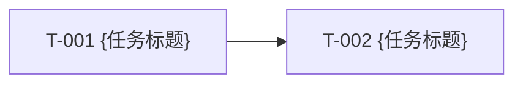
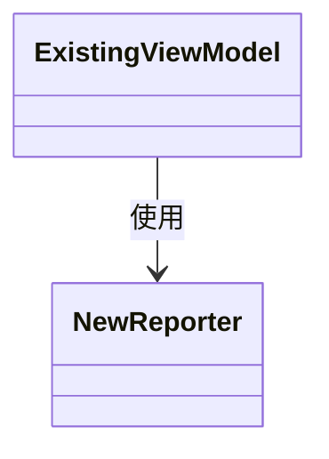

# 产物契约：output/design.md

## 路径

`output/design.md`

## 必需章节

- `# 技术方案 — {项目名称}`
- `## 审核状态`
- `## 任务总览`
- `## 设计视图`
- `## 任务详情`

## 任务总览

`## 审核状态` 必须符合 `contracts/review-status.md`。新生成或修订后的 `output/design.md` 状态必须为 `待审核`；只有用户确认后才能改为 `已确认` 并进入规格生成。

```markdown
| ID | 任务标题 | 关联需求 | 依赖 | 状态 |
|---|---|---|---|---|
| T-001 | {标题} | REQ-001 | — | 待开发 |
```

## 设计视图

`## 设计视图` 用于降低人工审核成本，必须使用 Markdown Mermaid 代码块或明确的不适用说明。图形只作为审核视图，不替代 `任务总览` 和 `任务详情` 中供规格生成使用的结构化字段。

图中的说明文字必须使用中文，包括节点说明、边说明、状态说明和流程判断说明；类型名、方法名、字段名、文件名、接口名、类名、枚举值等代码标识可以保持英文或项目原始命名。

### 任务依赖图

当任务数大于 1 时必须提供；单任务方案可以写不适用原因。

````markdown
### 任务依赖图


````

### 类关系图

默认应提供。只要存在代码仓库，且方案涉及现有类、接口、组件、数据结构或模块对象，就必须用 `classDiagram` 展示核心关系。纯配置、纯文案、纯样式、纯资源替换、无代码仓库或无法确定类/组件关系时，可以写不适用原因。

````markdown
### 类关系图


````

### 模块交互图

涉及跨模块调用、接口交互、事件、异步回调或外部服务时必须提供，可使用 `flowchart` 或 `sequenceDiagram`。

### 状态或决策流程图

涉及状态切换、阈值、分支判断、幂等、去重或重置规则时必须提供，可使用 `flowchart` 或 `stateDiagram-v2`。

## 任务详情

```markdown
### T-001 — {标题}

**技术目标：**
- {本任务要达成的可验证技术结果；不得复述 PRD 原文，不得写待确认内容}

**关联需求：**
- REQ-001

**依赖：** 无

**模块架构：**
- `{模块/组件/层}`：本次 `{新增/修改/删除/参与调用}`，说明 `{职责、归属、调用关系、数据流或边界变化}`。
- 涉及多个模块、跨层调用、事件流或状态流时补充任务局部 Mermaid 图；否则写“不适用：{原因}”。

**接口/方法定义：**
- `{文件}` / `{接口或方法}`：`{新增/修改/删除/签名变化/职责变化}`，`{签名}`，职责 `{职责}`。

**数据结构：**
- `{文件}` / `{类、interface、type、对象、schema 或配置项}`：`{新增/修改/删除}` `{字段、成员或结构名}`，类型或取值范围 `{类型或取值范围}`，说明 `{本次变化原因或映射关系}`。
- 无数据结构变更。

**设计约束：**
- {分支、兼容、幂等、异常、兜底、去重、阈值、状态切换或平台限制；无则写“无”}

**影响范围：**
- {受影响路径或模块}
```

## 编号规则

- 任务编号使用 `T-001`、`T-002`，按任务生成顺序递增。
- `任务总览` 和 `任务详情` 都必须按 `T-XXX` 升序排列。
- 新增任务时，新 `T-XXX` 取全文件最大任务编号递增，并插入表格和详情的正确编号位置。
- `设计视图` 中的 Mermaid 图必须使用 fenced code block，语言标记为 `mermaid`。
- `设计视图` 中 Mermaid 图的说明文字必须使用中文；类型名、方法名、字段名、文件名、接口名、类名、枚举值等代码标识可以保持英文或项目原始命名。

## 质量规则

- `output/analysis.md` 中每条纳入需求至少映射到一个任务。
- 审核状态必须存在，且进入规格生成前必须为 `已确认`。
- 依赖只表达硬代码依赖或产物依赖。
- 任务数大于 1 时必须提供任务依赖图。
- 存在代码仓库且涉及类、接口、组件、数据结构或模块对象时，必须提供类关系图；省略时必须说明不适用原因。
- 涉及跨模块调用、接口交互、事件、异步回调、状态切换、分支判断、阈值、幂等或去重时，必须提供对应交互图、时序图、状态图或决策流程图。
- `技术目标` 只写本任务要达成的可验证技术结果，不复述 PRD 原文、不写业务背景、不写待确认内容。
- `模块架构` 只写本任务涉及的模块、组件或层，以及职责归属、调用关系、数据流、事件流或边界变化；不得写接口签名、字段清单或异常兜底细节。
- `模块架构` 涉及多个模块、跨层调用、事件流或状态流时，可以补充任务局部 Mermaid 图；图必须服务本任务，不替代文字边界说明。
- `接口/方法定义` 只列本次需求相关且新增、修改、签名变化或职责变化的接口/方法；未变化的既有接口、复用调用和上下游依赖不得放入该字段。
- `接口/方法定义` 只描述文件、签名、职责、入参和出参；分支、兼容、幂等、异常、兜底、去重、阈值、状态切换等行为规则必须放入 `模块架构`、`数据结构` 或 `设计约束`。
- `数据结构` 只写本次新增、修改、删除的数据类、对象、字段、枚举、配置或 schema；每条至少包含归属位置、结构名、变更类型、字段/成员/结构名、类型或取值范围。
- `数据结构` 不写未变化字段，不使用表格强制定列；无变化时写“无数据结构变更”。
- `设计约束` 只写影响实现和验证的规则，包括兼容、异常、兜底、幂等、去重、阈值、状态切换、平台限制等；不得复述模块关系或接口签名。
- `影响范围` 只写受影响路径、模块、调用方、测试或回归范围；不得重复展开设计细节。
- 接口必须具体到足以支撑 `generate-specs`。
- 模块归属、接口形态或数据结构不确定时，必须写入设计阶段问题。
